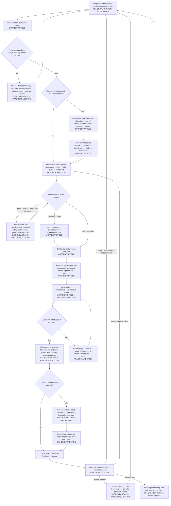

# Inner-child / reparenting therapy protocol — Canonical overview

Status: **research-stage operational architecture**
Date: 2026-08-17
Article editing: **not authorized**

This is the canonical visual control surface for the therapy protocol itself. It is not an article outline and does not replace the prose/evidence ledgers. A therapy bot should eventually be able to traverse this topology without inventing missing stages.

## Canonical inner-parent model — one parent, three qualities

The protocol has **one inner parent / integrated adult**, not three separate inner parents.

**Nurturer, Protector, and Guide are three distinguishable qualities or functions of that one parent:**

- the parent **nurtures**;
- the parent **protects**;
- the parent **guides**.

They are separated in the maps only because the capacities can be unevenly developed, context-specific, temporarily unavailable, confused with maladaptive substitutes, or borrowed one at a time. The therapeutic target is their **integration into one coherent adult presence**, not the construction of three independent internal characters.

This is a global anti-reification rule. Capitalized labels are functional shorthand for routing and reflection.

## Status vocabulary

- `CURRENT ARTICLE` — rule is already materially present in the frozen article.
- `PRACTICAL ADDITION` — operationally useful addition; novelty is irrelevant.
- `PROVISIONAL` — plausible protocol structure not yet ready to become a hard runtime rule.
- `RESEARCH NEEDED` — requires targeted evidence/collision attack.
- `KNOWN PRIOR ART` — useful but established.
- `STRICT TAIL SURVIVOR` — reserved for a residual that clears all Creative-Tail gates.
- `REJECTED FOR NOVELTY` — may remain useful but is not original.
- `SAFETY / EPISTEMIC GATE` — constraint that can veto deeper work, operation availability, or certainty.

## Canonical control flow

## Runtime invariants

These constraints apply across the graph rather than belonging to only one node.

1. **There is one inner parent / integrated adult with three qualities, not three parents.** Nurturer, Protector, and Guide are analytic distinctions within one parental presence. The functions may be assessed, borrowed, or developed separately, but successful internalization integrates them. Do not invite the user to construct three independent parent-entities unless that is clearly their own chosen metaphor and it remains nonliteral.
2. **Permission/risk routing precedes therapeutic operation selection.** First determine what classes of operation are currently permitted and what safety-relevant information is missing; only then choose among allowed reparenting operations. Safety judgment, operation selection and user-facing delivery must remain conceptually inspectable as separate responsibilities.
3. **Safety is longitudinal, not single-turn.** Track relevant multi-turn trajectories for deterioration and vulnerability-amplifying loops; a locally warm/supportive response can still reinforce avoidance, dependency, memory certainty, parts reification, coercion, failure debt, intensity chasing, or model self-sealing over time.
4. **Use operation-specific capacity, not a global `ready/not ready` identity.** The gate asks whether the person currently has—or can safely borrow—enough of the capacities this specific next operation consumes. Do not require symptom-free calm, zero distress, or indefinite stabilization before all meaningful work.
5. **Present safety outranks depth.** Loss of orientation, meaningful functional deterioration, escalating compulsion, or inability to choose/stop routes toward de-escalation and support rather than deeper elicitation.
6. **Do not force optional introspection.** A guard response is information, not an obstacle to defeat. Clear refusal stops or changes that optional exercise; a later attempt is not owed and requires renewed consent. At the same time, the bot must distinguish destabilization from tolerable difficulty so it does not automatically reward avoidance in external or genuinely chosen approach behavior.
7. **States report; the present adult integrates.** Child/protector/critic language represents working perspectives/functions. Reports of affect, sensation, preference, memory, imagery or prediction are meaningful data but are not automatically external facts or commands.
8. **Protector alarms trigger review, not truth or permanent veto.** The protecting quality of the one inner parent checks present danger, evidence, reversibility, capacity, alternatives, time pressure and appropriate expertise.
9. **Guide proposes; the present adult commits.** The guiding quality can surface values, direction and proportionate difficulty but cannot compel inward work or use `growth` to justify coercion.
10. **Do not diagnose a part from one signal.** Numbness, reluctance, anger, distraction, or silence may reflect protection, ordinary disagreement, fatigue, a present grievance, technique mismatch, or another explanation. User disagreement lowers confidence in the bot's formulation rather than confirming it.
11. **Adult capacity is not one scalar even though the adult is one integrated parent.** Its nurturing, protecting, and guiding qualities can be available unevenly by context. Real competence can coexist with possible parentification-linked overfunctioning or other costly asymmetry; do not call competence fake or infer parentification without developmental evidence.
12. **Nurturer care is not payment for obedience.** The same inner parent may protect or guide firmly while its nurturing quality remains warm/non-cruel. Behavior can have limits without love withdrawal.
13. **The present adult owns external behavior and consequences.** Internal reluctance is relevant information; it does not erase real obligations, another person's consent, or the consequences of action/inaction.
14. **Use parts/function language provisionally / as-if.** A useful inner perspective or parental quality is not thereby an authenticated independent person, diagnosis, danger detector, or historical witness.
15. **Historical provenance remains explicit.** Distress, conviction, imagery, dream material, hypnosis, felt sense, or entheogenic experience do not by themselves establish a historical event. Preserve the owner's distinct claim that felt sense **may** recover something conditioning obscured.
16. **Depth is not integration.** Depth concerns richness/degree of contact and normally access and/or intensity; integration concerns what is incorporated into ordinary understanding, behavior, functioning, and choice. Neither substitutes for the other.
17. **Internalization is not self-sufficiency.** `receive → observe → participate → initiate → internalize` remains the developmental target. Internalization means parental capacities become functions of the **one inner parent**. Friendship, therapy, community, co-regulation, and practical support may remain.
18. **No poor-outcome shortcut.** `No improvement yet` routes to a differential failure diagnosis; it does not directly route to `reparenting is wrong for this person`.
19. **Pain is not the only route to care.** Ordinary play, curiosity, beauty, companionship, silliness, celebration, and exploration belong in the continuing relationship.
20. **No-arrears means no punitive accumulation, not no accountability or no therapeutic dose.** Missed internal care practice can resume from the present; external consequences and dose-sensitive treatment requirements remain separate questions.
21. **Intervention matching is a heuristic, not a role diagnosis.** Nurturer/Protector/Guide substitution has strong prior-art neighbors in mode-specific therapy. Use actual response/outcome to test whether the currently expressed parental quality addresses the active process; simplify to ordinary formulation if the triad adds no decision value.
22. **Keep the three-quality distinction only if it earns its complexity.** The Nurturer/Protector/Guide vocabulary should be simplified if it produces more avoidance, coercion, reification, memory certainty, decision delay or procedural burden without improving clarity, safe approach, self-endorsed action, trust repair, autonomy or functioning. Simplification must not erase the unity of the inner parent.
23. **Missing material information is a gate.** If a transition depends on a safety/fit field that is genuinely unknown, collect it, choose an operation that does not require it, or defer/escalate. Do not fabricate the field from conversational tone.
24. **Provisional ideas do not silently become runtime law.** Integration-load thresholds, post-de-escalation recognition criteria, and other live candidates remain visibly provisional until their evidence/adjudication is adequate.

## Required drill-downs

1. [`maps/01-STATE-ASSESSMENT-AND-ROUTING.md`](maps/01-STATE-ASSESSMENT-AND-ROUTING.md)
2. [`maps/02-ADULT-FUNCTION-ARCHITECTURE.md`](maps/02-ADULT-FUNCTION-ARCHITECTURE.md)
3. [`maps/03-PROTECTOR-RESISTANCE-HANDLING.md`](maps/03-PROTECTOR-RESISTANCE-HANDLING.md)
4. [`maps/04-TRUST-PROMISE-RUPTURE-REPAIR.md`](maps/04-TRUST-PROMISE-RUPTURE-REPAIR.md)
5. [`maps/05-IDENTITY-AND-DIFFERENTIATION.md`](maps/05-IDENTITY-AND-DIFFERENTIATION.md)
6. [`maps/06-DEPTH-AND-ALTERED-STATES.md`](maps/06-DEPTH-AND-ALTERED-STATES.md)
7. [`maps/07-EXTERNAL-SUPPORT-ARCHITECTURE.md`](maps/07-EXTERNAL-SUPPORT-ARCHITECTURE.md)
8. [`maps/08-OUTCOME-FAILURE-DIAGNOSIS.md`](maps/08-OUTCOME-FAILURE-DIAGNOSIS.md)
9. [`maps/09-BOT-SAFETY-AND-ROUTING.md`](maps/09-BOT-SAFETY-AND-ROUTING.md)

## Companion control artifacts

- `ARTICLE-PROTOCOL-CROSSWALK.md` — article explanation versus protocol behavior.
- `PROTOCOL-GAP-LEDGER.md` — dead ends, missing recognition criteria, conflict points, fallback gaps and safety risks.
- `CANDIDATE-STATUS-LEDGER.md` — retained/provisional/rejected Tail ideas with runtime disposition.
- `EVIDENCE-LEDGER.md` — support, challenges, limitations and unresolved research for protocol nodes.
- `candidate-ledger-batch-004.csv` — frozen retrieval-free structural-gap batch plus post-retrieval adjudication.
- `retrieval/REMAINING-PROTOCOL-GAPS-EXA-20260817.md` — evidence for operation-specific readiness, intervention matching, parentification assessment and longitudinal bot routing.

Material topology changes must update this overview in the same change as the corresponding protocol-state change.
