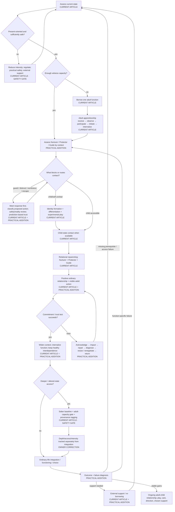

# Inner-child / reparenting therapy protocol — Canonical overview

Status: **research-stage operational architecture**
Date: 2026-08-17
Article editing: **not authorized**

This is the canonical visual control surface for the therapy protocol itself. It is not an article outline and does not replace the prose/evidence ledgers. A therapy bot should eventually be able to traverse this topology without inventing missing stages.

## Status vocabulary

- `CURRENT ARTICLE` — rule is already materially present in the frozen article.
- `PRACTICAL ADDITION` — operationally useful addition; novelty is irrelevant.
- `PROVISIONAL` — plausible protocol structure not yet ready to become a hard runtime rule.
- `RESEARCH NEEDED` — requires targeted evidence/collision attack.
- `KNOWN PRIOR ART` — useful but established.
- `STRICT TAIL SURVIVOR` — reserved for a residual that clears all Creative-Tail gates.
- `REJECTED FOR NOVELTY` — may remain useful but is not original.
- `SAFETY / EPISTEMIC GATE` — constraint that can veto deeper work or certainty.

## Canonical control flow

## Runtime invariants

These constraints apply across the graph rather than belonging to only one node.

1. **Present safety outranks depth.** Loss of orientation, meaningful functional deterioration, compulsion, or inability to choose routes toward de-escalation and support rather than deeper elicitation.
2. **Do not force optional introspection.** A guard response is information, not an obstacle to defeat. Clear refusal stops or changes that optional exercise; a later attempt is not owed and requires renewed consent. At the same time, the bot must distinguish destabilization from tolerable difficulty so it does not automatically reward avoidance in external or genuinely chosen approach behavior.
3. **States report; the present adult integrates.** Child/protector/critic language represents working perspectives/functions. Reports of affect, sensation, preference, memory, imagery or prediction are meaningful data but are not automatically external facts or commands.
4. **Protector alarms trigger review, not truth or permanent veto.** Check present danger, evidence, reversibility, capacity, alternatives, time pressure and appropriate expertise.
5. **Guide proposes; the present adult commits.** Guide can surface values, direction and proportionate difficulty but cannot compel inward work or use `growth` to justify coercion.
6. **Do not diagnose a part from one signal.** Numbness, reluctance, anger, distraction, or silence may reflect protection, ordinary disagreement, fatigue, a present grievance, technique mismatch, or another explanation. User disagreement lowers confidence in the bot's formulation rather than confirming it.
7. **Adult capacity is not one scalar.** Nurturer, Protector, and Guide can be available unevenly by context; visible competence can be parentified survival overfunctioning without making the competence unreal.
8. **Nurturer care is not payment for obedience.** Guide/Protector may set limits while warmth/non-cruelty remains available. Behavior can have limits without love withdrawal.
9. **The present adult owns external behavior and consequences.** Internal reluctance is relevant information; it does not erase real obligations, another person's consent, or the consequences of action/inaction.
10. **Use parts language provisionally / as-if.** A useful inner perspective is not thereby an authenticated independent person, diagnosis, danger detector, or historical witness.
11. **Historical provenance remains explicit.** Distress, conviction, imagery, dream material, hypnosis, felt sense, or entheogenic experience do not by themselves establish a historical event. Preserve the owner's distinct claim that felt sense **may** recover something conditioning obscured.
12. **Depth is not integration.** Depth concerns richness/degree of contact and normally access and/or intensity; integration concerns what is incorporated into ordinary understanding, behavior, functioning, and choice. Neither substitutes for the other.
13. **Internalization is not self-sufficiency.** `receive → observe → participate → initiate → internalize` remains the developmental target for the reparenting function. Friendship, therapy, community, co-regulation, and practical support may remain.
14. **No poor-outcome shortcut.** `No improvement yet` routes to a differential failure diagnosis; it does not directly route to `reparenting is wrong for this person`.
15. **Pain is not the only route to care.** Ordinary play, curiosity, beauty, companionship, silliness, celebration, and exploration belong in the continuing relationship.
16. **No-arrears means no punitive accumulation, not no accountability or no therapeutic dose.** Missed internal care practice can resume from the present; external consequences and dose-sensitive treatment requirements remain separate questions.
17. **Keep the role interface only if it earns its complexity.** The Nurturer/Protector/Guide vocabulary should be simplified if it produces more avoidance, coercion, reification, memory certainty, decision delay or procedural burden without improving clarity, safe approach, self-endorsed action, trust repair, autonomy or functioning.
18. **Provisional ideas do not silently become runtime law.** Integration-load thresholds, function-substitution utility, post-de-escalation recognition criteria, and other live candidates remain visibly provisional until their evidence/adjudication is adequate.

## Required drill-downs

1. [`maps/01-STATE-ASSESSMENT-AND-ROUTING.md`](maps/01-STATE-ASSESSMENT-AND-ROUTING.md)
2. [`maps/02-ADULT-FUNCTION-ARCHITECTURE.md`](maps/02-ADULT-FUNCTION-ARCHITECTURE.md)
3. [`maps/03-PROTECTOR-RESISTANCE-HANDLING.md`](maps/03-PROTECTOR-RESISTANCE-HANDLING.md)
4. [`maps/04-TRUST-PROMISE-RUPTURE-REPAIR.md`](maps/04-TRUST-PROMISE-RUPTURE-REPAIR.md)
5. [`maps/05-IDENTITY-AND-DIFFERENTIATION.md`](maps/05-IDENTITY-AND-DIFFERENTIATION.md)
6. [`maps/06-DEPTH-AND-ALTERED-STATES.md`](maps/06-DEPTH-AND-ALTERED-STATES.md)
7. [`maps/07-EXTERNAL-SUPPORT-ARCHITECTURE.md`](maps/07-EXTERNAL-SUPPORT-ARCHITECTURE.md)
8. [`maps/08-OUTCOME-FAILURE-DIAGNOSIS.md`](maps/08-OUTCOME-FAILURE-DIAGNOSIS.md)

## Companion control artifacts

- `ARTICLE-PROTOCOL-CROSSWALK.md` — article explanation versus protocol behavior.
- `PROTOCOL-GAP-LEDGER.md` — dead ends, missing recognition criteria, conflict points, fallback gaps and safety risks.
- `CANDIDATE-STATUS-LEDGER.md` — retained/provisional/rejected Tail ideas with runtime disposition.
- `EVIDENCE-LEDGER.md` — support, challenges, limitations and unresolved research for protocol nodes.
- `candidate-ledger-batch-004.csv` — frozen retrieval-free structural-gap batch plus post-retrieval adjudication.

Material topology changes must update this overview in the same change as the corresponding protocol-state change.
