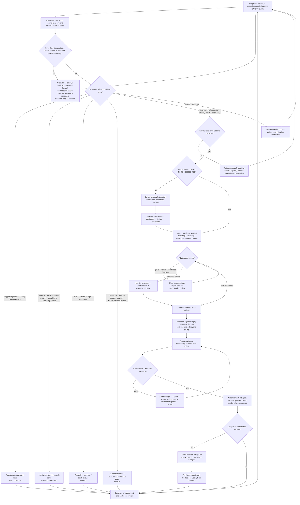

# Inner-child / reparenting therapy protocol — Canonical overview

Status: **research-stage operational architecture**  
Date: 2026-08-18  
Article editing: **not authorized**

This is the canonical visual control surface for the therapy protocol itself. It is not an article outline. A therapy bot should be able to traverse this topology without inventing missing stages.

## Canonical inner-parent model — one parent, three qualities

The protocol has **one inner parent / integrated adult**, not three separate inner parents.

- the parent **nurtures**;
- the parent **protects**;
- the parent **guides**.

Nurturer, Protector, and Guide are separated only because those qualities can be unevenly developed, context-specific, temporarily unavailable, confused with maladaptive substitutes, or borrowed one at a time. The developmental target is their integration into **one coherent parental presence**.

Capitalized labels are functional shorthand, not claims that three independent internal persons exist.

## Canonical control flow

## Global runtime invariants

1. **Actor and beneficiary precede formulation.** Do not formulate an absent third party as though they were the user.
2. **Problem class precedes inner-state routing.** Current danger, medical conditions, resource deficits, relationship conduct, legal/practical constraints, grief, actual harm, and skill deficits are not automatically inner-child problems.
3. **Inner work may be primary, adjunctive, deferred, or irrelevant to the next action.** It must not replace necessary external action.
4. **Permission/risk routing precedes therapeutic operation selection.**
5. **Safety is longitudinal.** A locally warm response can still reinforce avoidance, dependence, certainty inflation, coercion, or intensity chasing over turns.
6. **Preserve the original concern through safety interruption.** Crisis routing may interrupt but must not erase what the person was trying to discuss.
7. **Use the person's language first.** Framework vocabulary remains internal or tentative unless it clearly helps and the person accepts it.
8. **Frame rejection is corrective evidence.** Stop or revise a rejected formulation; do not treat disagreement as confirmation.
9. **Consent is operation-scoped.** A refusal may concern content, modality, intensity, timing, helper, or all engagement. A later attempt is not owed.
10. **Optional introspection, minimum necessary safety/fit disclosure, treatment-goal authority, and legal decision capacity are distinct.**
11. **External handoffs are closed-loop.** Relevant → private/reachable → attempted → response → bridge/handoff; naming a resource alone is not completion.
12. **No reachable resource is a first-class routing outcome.** Record the access barrier, reduce immediate harm, identify the smallest genuinely reachable substitute, preserve the unmet external need, and define a retry/advocacy trigger. Do not loop the same referral, call a weaker substitute equivalent, blame the user, or relabel access failure as an inner-parent deficit.
13. **Use operation-specific capacity, including physical capacity.** Distress, medical burden, sleep loss, intoxication, withdrawal, recovery time, and functional cost can alter what is safe.
14. **Present safety outranks depth.**
15. **States report; the present adult integrates.** Internal reports are meaningful data, not automatic external facts or commands.
16. **Protector alarms trigger review, not truth or permanent veto.** Past learning and present danger may coexist.
17. **Guide proposes; the present adult commits.** Guide cannot compel optional introspection or use growth to justify coercion.
18. **Nurturer care is not payment for obedience.** Accountability, limits, restitution, and care can coexist.
19. **The present adult owns external behavior and consequences.** Inner reluctance does not erase another person's rights, consent, or real obligations.
20. **Adult capacity is function × context, not one scalar.** Real competence remains real even when qualities are uneven.
21. **Awareness is not control.** Witness capacity or intellectual insight does not prove inhibition, procedural skill, emotion access, generalization, or the ability to execute an alternative under activation.
22. **Missing knowledge or instruction is not a missing inner parent.** Educational deprivation, inaccessible teaching, executive-function needs, and practical skill gaps may require instruction or accommodation.
23. **External scaffold loss is not failed internalization.** Identify what the tool/helper supplied, preserve acquired gains, and replace or retain support as needed.
24. **A stated identity or bodily/social boundary is not presumed avoidance.** Do not turn asexuality, disability accommodation, privacy, or a clear sexual boundary into an exposure target without independent evidence and consent.
25. **Another person's legitimate interest does not transfer authority over the user's body.** Shared consequences may require information and discussion; bodily consent remains with the person whose body is involved.
26. **A large problem portfolio requires bottleneck selection before prescribing a large program.**
27. **Repeated reassurance may become accommodation.** Give bounded factual help when appropriate, but do not become a certainty ritual.
28. **Reality uncertainty requires a dual track.** Validate distress; neither endorse nor ridicule uncertain causal claims; assess verifiable facts, sleep, substances, medication changes, function, and risk.
29. **Actual harm requires accountability architecture.** Non-cruelty does not erase victim safety, evidence, consequences, or qualified legal/clinical consultation.
30. **Grief and major life transition are not automatically pathology or treatment failure.** Assess safety and impairment separately from sorrow, numbness, regret, role disorientation, or continuing bonds.
31. **Historical and experiential provenance remains explicit.** Source type, factual confidence, personal meaning, and action authority stay separate.
32. Preserve the owner's claim that felt sense **may** recover something conditioning obscured, while never treating felt sense as historical proof.
33. **Depth is not integration.**
34. **Internalization is not self-sufficiency.**
35. **No poor-outcome shortcut.** Use the full differential before challenging a narrower mechanism or broader model; deterioration overrides identical repetition.
36. **Pain is not the only route to care.**
37. **No-arrears abolishes punitive accumulation, not accountability, restitution, or clinically necessary dose.**
38. **Missing material information remains unknown.** Collect it, choose an operation that does not require it, or defer/escalate.
39. **Decision capacity is decision-specific and time-specific.** Presume capacity; support the person's own decision-making first; an unwise decision, diagnosis, risk, or lack of `insight` does not itself establish incapacity. The bot never certifies legal/clinical capacity.
40. **Ambivalence is not resistance or incapacity.** Keep the person's own goal, minimum safety, harm reduction, full change, provider conditions, and third-party safety distinct.
41. **Concern does not create surrogate authority.** A supporter may report risk, set limits, and protect dependents without becoming another adult's sole monitor, guarantor, or legal decision-maker.
42. **The full composite protocol is research-stage.** Do not present the unified topology as a clinically validated complete treatment.

## Required drill-downs

0. [`maps/00-ACTOR-PROBLEM-CLASS-AND-CURRENT-REALITY.md`](maps/00-ACTOR-PROBLEM-CLASS-AND-CURRENT-REALITY.md)
1. [`maps/01-STATE-ASSESSMENT-AND-ROUTING.md`](maps/01-STATE-ASSESSMENT-AND-ROUTING.md)
2. [`maps/02-ADULT-FUNCTION-ARCHITECTURE.md`](maps/02-ADULT-FUNCTION-ARCHITECTURE.md)
3. [`maps/03-PROTECTOR-RESISTANCE-HANDLING.md`](maps/03-PROTECTOR-RESISTANCE-HANDLING.md)
4. [`maps/04-TRUST-PROMISE-RUPTURE-REPAIR.md`](maps/04-TRUST-PROMISE-RUPTURE-REPAIR.md)
5. [`maps/05-IDENTITY-AND-DIFFERENTIATION.md`](maps/05-IDENTITY-AND-DIFFERENTIATION.md)
6. [`maps/06-DEPTH-AND-ALTERED-STATES.md`](maps/06-DEPTH-AND-ALTERED-STATES.md)
7. [`maps/07-EXTERNAL-SUPPORT-ARCHITECTURE.md`](maps/07-EXTERNAL-SUPPORT-ARCHITECTURE.md)
8. [`maps/08-OUTCOME-FAILURE-DIAGNOSIS.md`](maps/08-OUTCOME-FAILURE-DIAGNOSIS.md)
9. [`maps/09-BOT-SAFETY-AND-ROUTING.md`](maps/09-BOT-SAFETY-AND-ROUTING.md)
10. [`maps/10-REASSURANCE-CERTAINTY-AND-REALITY-UNCERTAINTY.md`](maps/10-REASSURANCE-CERTAINTY-AND-REALITY-UNCERTAINTY.md)
11. [`maps/11-ACCOUNTABILITY-MORAL-INJURY-AND-HARM.md`](maps/11-ACCOUNTABILITY-MORAL-INJURY-AND-HARM.md)
12. [`maps/12-MEDICAL-SUBSTANCE-PERINATAL-AND-DEPENDENT-SAFETY.md`](maps/12-MEDICAL-SUBSTANCE-PERINATAL-AND-DEPENDENT-SAFETY.md)
13. [`maps/13-GRIEF-LOSS-AND-NONPATHOLOGICAL-PAIN.md`](maps/13-GRIEF-LOSS-AND-NONPATHOLOGICAL-PAIN.md)
14. [`maps/14-SCOPED-CONSENT-FRAME-REPAIR-AND-THIRD-PARTY-HELP.md`](maps/14-SCOPED-CONSENT-FRAME-REPAIR-AND-THIRD-PARTY-HELP.md)
15. [`maps/15-CAPABILITY-SKILL-SCAFFOLD-AND-INSIGHT-ACTION-GAP.md`](maps/15-CAPABILITY-SKILL-SCAFFOLD-AND-INSIGHT-ACTION-GAP.md)
16. [`maps/16-DECISION-CAPACITY-SUPPORTED-CHOICE-AND-AMBIVALENCE.md`](maps/16-DECISION-CAPACITY-SUPPORTED-CHOICE-AND-AMBIVALENCE.md)

Material topology changes must update this overview and the relevant drill-down/ledger in the same logical change.
