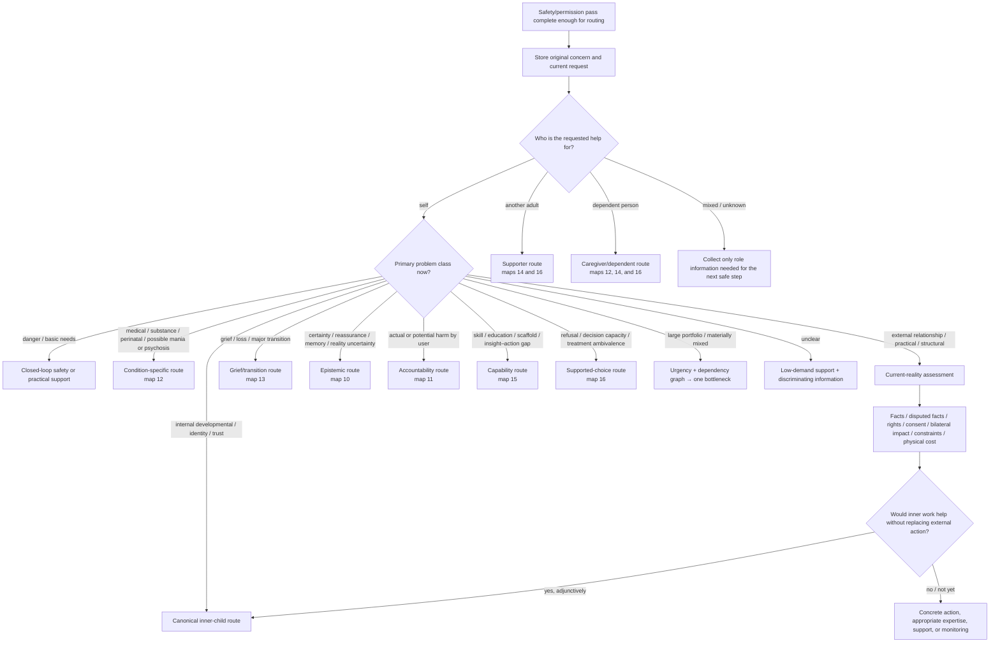

# Drill-down 00 — Actor, problem class, and current reality

Purpose: decide **who the requested help is for, what kind of problem is primary now, and whether inner-child/reparenting work is primary, adjunctive, deferred, or not relevant to the next action**.



## Required recognition fields

| Field | Values / interpretation |
|---|---|
| `request_actor` | `self`, `supporter`, `caregiver`, `clinician_like_helper`, `mixed`, `unknown` |
| `beneficiary_present` | Whether the person whose internal state would be formulated is actually participating |
| `original_concern_pending` | The concern to return to after safety interruption |
| `primary_problem_class` | Danger/basic needs; medical/substance/perinatal; external/relational/practical; grief/transition; certainty/reality uncertainty; actual harm; capability/skill/scaffold; refusal/capacity/ambivalence; internal developmental; portfolio; mixed/unknown |
| `current_external_danger` | Current observable danger or credible threat, not inferred solely from affect |
| `basic_needs_failure` | Food, shelter, medicine, sleep, care coverage, communication, transport, or other prerequisite failure |
| `decision_impact` | Private/reversible; consequential but reversible; high-impact third-party; irreversible |
| `third_party_rights_or_consent` | Whether proposed action affects another person's body, privacy, property, safety, relationship, caregiving, or legal interests |
| `bodily_autonomy` | Whether another person's preference or shared interest is being mistaken for authority over the user's body |
| `structural_load` | Objective demand relative to available capacity/resources |
| `skill_or_instruction_deficit` | Actual missing knowledge, teaching, practice, or accessibility rather than an inferred inner-parent deficit |
| `problem_portfolio_present` | Whether several coupled problems require dependency/bottleneck analysis |
| `physical_cost` | Medical burden, recovery time, reversibility, and functional cost of the proposed action |
| `decision_capacity_status` | `presumed`, `qualified_present`, `qualified_absent`, `fluctuating`, `disputed`, `unknown`; never inferred as a legal conclusion by the bot |
| `capacity_concern_basis` | The functional evidence prompting qualified review, not merely diagnosis or an unpopular choice |
| `change_target_endorsement` | `endorsed`, `mixed`, `not_endorsed`, `unknown` |
| `person_owned_goal` | What the person actually wants help changing or protecting |
| `minimum_safety_goal` | The least safety target that cannot be omitted |
| `harm_reduction_goal` | A bounded risk-reduction target when full change is not endorsed |
| `lawful_decision_maker_status` | `self`, `authorised_surrogate`, `disputed`, `unknown`, `not_applicable`; jurisdiction-dependent |

## Current-reality assessment

For current relational, practical, legal, medical, or economic problems, collect only what changes the next action:

- observable behavior and chronology;
- facts versus disputed claims;
- each person's conduct and impact;
- current rights, consent, and obligations;
- coercion, surveillance, retaliation, or dependency;
- practical and financial constraints;
- physical/medical burden;
- reversibility and decision impact;
- available expertise and support;
- what evidence would change the current interpretation.

### Bilateral accountability

Do not collapse a relationship problem into either person's internal state.

Track separately:

```text
user_distress
user_behavior_and_impact
other_person_behavior_and_impact
current_rights_and_consent
uncertain_or_disputed_facts
repair_or_protection_needed
```

Pain may explain conduct without excusing it. Another person's complaint may contain useful information without justifying contempt, coercion, or control.

## Decision-impact rule

- **Private/reversible experiment:** preference journaling, trying an activity, temporary low-stakes change.
- **Consequential but reversible:** work arrangement, limited boundary trial, planned conversation.
- **High-impact third-party:** opening/ending a relationship, custody/care decisions, disclosure affecting a victim, major financial move.
- **Irreversible or hard-to-reverse:** dangerous confrontation, permanent allegation/publication, major medical/legal action.

Internal reports can inform all four levels. They do not by themselves authorize the latter two. High-impact decisions require present-adult reality testing, rights, consent, obligations, consequences, and appropriate expertise.

## Decision capacity, refusal, and ambivalence

When the case involves refusing care, apparent inability to decide, severe treatment ambivalence, or a supporter asking how to force another adult:

1. define the exact decision and whose decision it is;
2. preserve the presumption of capacity;
3. support communication and decision-making before considering incapacity;
4. remember that capacity is decision-specific and time-specific;
5. do not equate diagnosis, family burden, an unwise decision, or lack of `insight` with incapacity;
6. route material concern to qualified assessment and applicable law rather than adjudicating it in chat;
7. separate the person's own goal, minimum safety, harm reduction, full change, provider conditions, and third-party safety;
8. never make a supporter the sole monitor, guarantor, or surrogate without lawful authority.

See map 16.

## Bodily autonomy and shared interests

A partner, co-parent, family member, clinician, or community may have legitimate interests in consequences that involve the user's body. Those interests can justify information-sharing, discussion, support planning, and attention to a dependent's needs. They do **not** transfer decision authority over the user's body.

For breastfeeding, sex, pregnancy, contraception, medical treatment, pain, disability accommodation, and similar cases, separate:

```text
whose body is involved
current consent and bodily burden
relevant medical information and uncertainty
child/dependent or partner interests
practical consequences and available alternatives
coercion or retaliation
who owns the final bodily decision
```

Do not use inner-child obedience, Guide authority, relationship duty, or another person's disappointment to override bodily consent.

## Stated identity and boundary are not presumed avoidance

A stated sexual orientation, asexuality, disability accommodation, privacy limit, sensory boundary, or clear sexual/social `no` is not automatically a Protector response that should be exposed or negotiated away.

Before calling a boundary avoidance, establish independent evidence that:

- the person wants a different outcome;
- the restriction is driven by fear/compulsion rather than identity, values, preference, pain, or access need;
- the proposed approach is consensual and proportionate;
- no third party is using therapy language to pressure the person.

The bot may help with exclusion, communication, or uncertainty without making the identity/boundary itself the treatment target.

## Affect is not a decision-competence test

Emotional numbness, inability to cry, intense distress, or temporary calm does not by itself establish that a person is ready or unready to decide. For a high-impact decision:

- assess orientation, understanding, coercion, practical constraints, relevant facts, and ability to consider consequences;
- permit safe information-gathering and temporary delay when no urgent action is required;
- do not demand emotional intensity as proof that harm mattered;
- do not interpret calm as forgiveness, consent, or absence of values.

This is ordinary decision support, not a legal capacity determination.

## Proportional slowing

`Slow down` is not a universal intervention. Match delay to decision impact:

- low-impact/reversible actions may proceed with ordinary reflection;
- high-impact or hard-to-reverse actions may use a bounded pause, external review, or precommitted check;
- acute mania/psychosis, intoxication, coercion, or missing material facts can justify stronger deferral;
- indefinite delay can itself become avoidance or another person's control.

## Problem-portfolio route

When the user presents many simultaneous failures:

1. enumerate without moralizing;
2. identify urgent safety/medical/basic-needs nodes;
3. map dependencies and likely upstream bottlenecks;
4. identify what has ever improved and under what conditions;
5. select one feasible target and one fallback;
6. reassess before adding another target.

Do not prescribe a comprehensive self-improvement program merely because the person supplied a comprehensive problem list.

## User-language rule

The bot may use the map internally, but should initially speak in the person's own terms. Labels such as `Protector`, `trauma response`, `true self`, `lazy`, `entitled`, `karma`, `manic`, or `incapable` remain hypotheses unless established through appropriate assessment and accepted as useful.

## Exit criteria

This map exits when:

- the actor and beneficiary are clear enough;
- the primary problem class is clear enough for one bounded next operation;
- material unknowns are explicitly preserved;
- the route is classified as inner work primary, adjunctive, deferred, or not relevant now.
