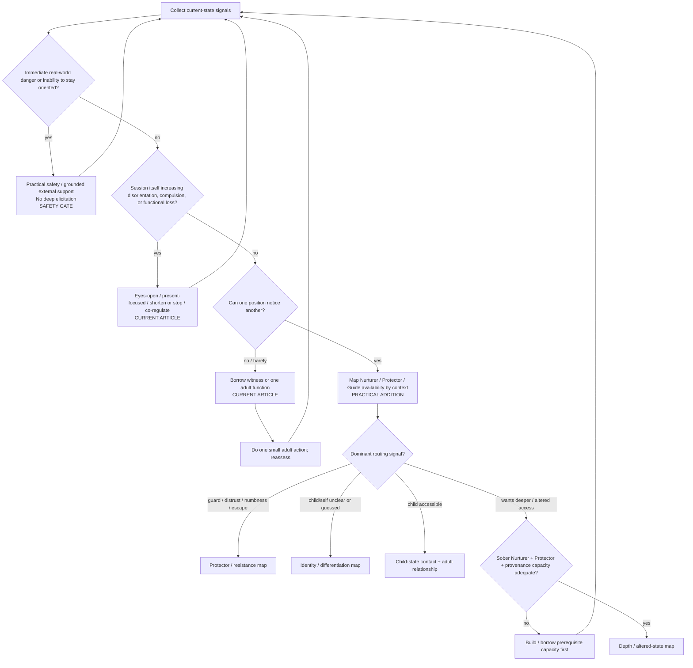

# Drill-down 01 — State assessment and routing

Purpose: decide **what state the person is in, what can safely happen next, and what should not happen yet**. This is a routing lens, not a diagnosis.

## Recognition fields

| State signal | Recognition conditions | Primary action | Do not do | Fallback / next state |
|---|---|---|---|---|
| Present orientation insufficient | Cannot reliably track current room/time/body; session material repeatedly displaces present reality; choice markedly narrows | Stop deeper elicitation; orient; practical safety; external support as needed | Ask for more memory, imagery, symbolic meaning, or emotional intensity | Reassess from entry after orientation returns |
| Session is destabilizing | Less able to function after practice; escalating compulsion, agitation, dissociation-like disconnection, or inability to disengage | Shorten/stop; eyes-open present focus; basic care; co-regulation | Treat greater intensity as success | Return to state assessment |
| Witness capacity weak | Person cannot yet distinguish `a younger state is here` from total identification | Borrow witness/adult function; third-person perspective; concrete adult action | Demand warmth, wisdom, imagery, or full self-parenting | Adult-function architecture |
| Witness present but adult functions uneven | Can observe states but cannot reliably nurture/protect/guide in relevant context | Function × context assessment | Repeat observer work merely because another function is missing | Target missing function |
| Guard response dominant | Numbness, sarcasm, distraction, urge to leave/use/scroll, anger, intellectualization, shutdown, or direct refusal | Start with what appeared; test multiple explanations | Declare `this is a protector` as fact; push through | Protector map |
| Child/self unclear | Answers feel guessed/performed; preferences depend strongly on social cues; no coherent younger state | Identity conditions + experimental play + differentiation | Manufacture a child image or `true self`; force historical narrative | Identity map, then re-enter child contact when available |
| Child accessible | Emotion/image/posture/voice/need can be contacted while enough adult/witness capacity remains | Relational reparenting using relevant adult functions | Let child-state testimony automatically determine external action | Trust/relationship path |
| Altered/deeper access requested | User wants hypnosis, dream incubation, intensive meditation, entheogenic or other depth-amplifying work | Check sober baseline, Nurturer/Protector capacity, provenance discipline, integration load | Use depth to compensate for absent stabilization | Depth map or prerequisite-building |

## Minimum information the bot must collect before routing deeper

- present orientation and ability to stop;
- whether the session is improving or degrading ordinary function;
- whether a witness position is available;
- current Nurturer / Protector / Guide access, at least in the relevant context;
- what showed up when contact was attempted;
- whether the person has practical support if material exceeds current capacity;
- whether experiential material is direct memory, testimony, inference, image, dream, hypnosis, altered-state content, metaphor, or uncertainty.

## Conflict rule: tolerable difficulty versus destabilization

`This is uncomfortable` is not by itself a stop signal, and `a part says no` is not proof that all difficult action is unsafe. Conversely, the Guide's growth function does not authorize forcing optional inner exploration.

Working routing distinction:

- **optional introspection:** preserve present choice; if refusal is clear, stop the elicitation and work with the refusal/conditions instead;
- **ordinary external responsibility:** the present adult may still take proportionate action even while a child/protector dislikes it, while Nurturer care remains available;
- **destabilization:** loss of orientation, choice, or meaningful function overrides depth/growth goals and routes to de-escalation.

The exact internal-jurisdiction architecture remains `PROVISIONAL / RESEARCH NEEDED`; do not treat this drill-down as proof of originality or as a fully validated constitution.
