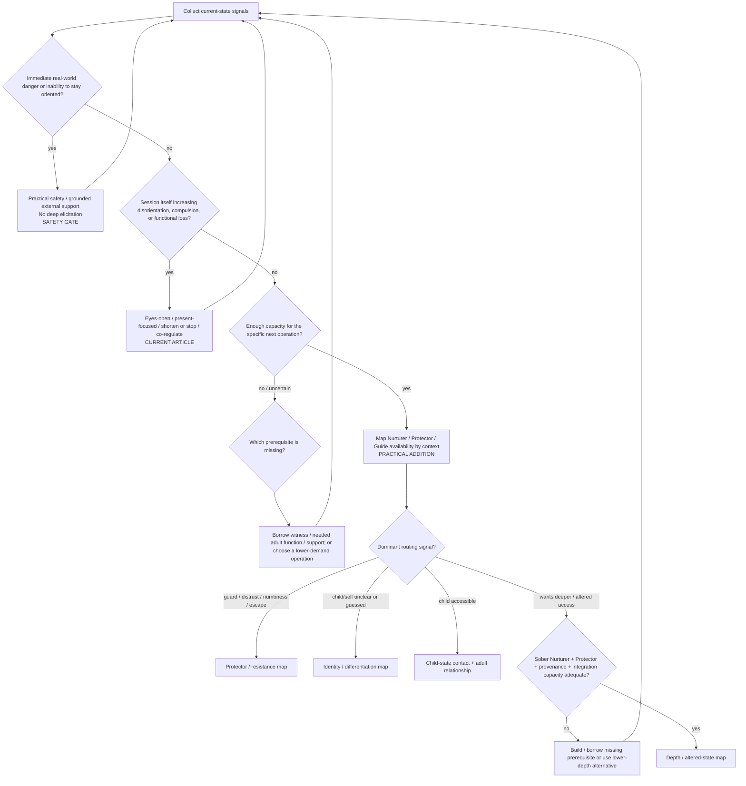

# Drill-down 01 — State assessment and routing

Purpose: decide **what state the person is in, what can safely happen next, and what should not happen yet**. This is a routing lens, not a diagnosis.

The future therapy bot should enter this therapeutic routing map only after the longitudinal safety/permission pass in [`09-BOT-SAFETY-AND-ROUTING.md`](09-BOT-SAFETY-AND-ROUTING.md) permits ordinary reflective work.

## Recognition fields

| State signal | Recognition conditions | Primary action | Do not do | Fallback / next state |
|---|---|---|---|---|
| Present orientation insufficient | Cannot reliably track current room/time/body; session material repeatedly displaces present reality; choice markedly narrows | Stop deeper elicitation; orient; practical safety; external support as needed | Ask for more memory, imagery, symbolic meaning, or emotional intensity | Reassess from entry after orientation returns |
| Session is destabilizing | Less able to function after practice; escalating compulsion, agitation, dissociation-like disconnection, or inability to disengage | Shorten/stop; eyes-open present focus; basic care; co-regulation | Treat greater intensity as success | Return to state assessment |
| Witness capacity weak **for the proposed task** | Person cannot yet distinguish `a younger state is here` from total identification enough to perform that operation | Borrow witness/adult function; third-person perspective; concrete adult action; or use lower-demand method | Demand warmth, wisdom, imagery, or full self-parenting | Adult-function architecture / simpler operation |
| Witness present but adult functions uneven | Can observe states but cannot reliably nurture/protect/guide in relevant context | Function × context assessment | Repeat observer work merely because another function is missing | Target missing function |
| Guard response dominant | Numbness, sarcasm, distraction, urge to leave/use/scroll, anger, intellectualization, shutdown, or direct refusal | Start with what appeared; test multiple explanations and classify the proposed action | Declare `this is a protector` as fact; push optional introspection | Protector map |
| Child/self unclear | Answers feel guessed/performed; preferences depend strongly on social cues; no coherent younger state | Identity conditions + experimental play + differentiation | Manufacture a child image or `true self`; force historical narrative | Identity map, then re-enter child contact when available |
| Child accessible | Emotion/image/posture/voice/need can be contacted while enough adult/witness capacity remains for the chosen step | Relational reparenting using relevant adult functions | Let child-state testimony automatically determine external action | Trust/relationship path |
| Altered/deeper access requested | User wants hypnosis, dream incubation, intensive meditation, entheogenic or other depth-amplifying work | Check sober baseline, Nurturer/Protector capacity, provenance discipline, integration load, ability to stop | Use depth to compensate for insufficient current capacity | Depth map or prerequisite-building/lower-depth alternative |

## Minimum information the bot must collect before routing deeper

- present orientation and ability to stop/change course;
- whether the session and recent trajectory are improving or degrading ordinary function;
- whether enough witness/adult capacity exists **for the specific proposed operation**;
- current Nurturer / Protector / Guide access in the relevant context;
- what showed up when contact was attempted and what alternative explanations remain;
- present consent for optional inward work;
- whether practical support is available if material exceeds current capacity;
- whether experiential material is direct memory, testimony, inference, image, dream, hypnosis, altered-state content, metaphor, or uncertainty;
- whether the previous depth session remains unresolved enough that another deliberate escalation would be premature.

If a material field is genuinely unknown, collect it, choose an operation that does not require it, or defer/escalate. Do not fabricate the missing state from conversational tone.

## Operation-specific capacity, not a global `ready for trauma work` identity

`PRACTICAL ADDITION / SAFETY SUPPORT`

The evidence pass did **not** justify a universal readiness score, a fixed stabilization period, zero distress, or a blanket rule that dissociation-like symptoms permanently bar deeper therapeutic work. Conversely, current loss of orientation, meaningful choice, ability to stop, or ordinary function can make a particular operation inappropriate now.

Use the **least restrictive sufficient gate for the next bounded operation**.

The question is not:

> `Is this person fully regulated/stabilized/healed enough?`

It is:

> `Does this person currently have—or can they safely borrow—enough of the capacities this specific next operation consumes?`

### Anti-readiness trap

Do not repeatedly defer all meaningful work because the user still has symptoms or distress. Some evidence-based trauma treatments deliberately involve tolerable activation, and substantial dissociative symptoms do not by themselves establish that no trauma-focused work can be helpful.

For this protocol:

- **distress alone** is not a stop signal;
- **loss of orientation, meaningful choice, ability to disengage, or continuing functional deterioration** is a stronger reason to de-escalate;
- use lower-demand reparenting, practical adult action, borrowed capacity or external support when the proposed operation exceeds current capacity;
- re-evaluate capacity dynamically rather than assigning a durable `not ready` label.

This does not authorize a therapy bot to improvise formal trauma exposure. It prevents `stabilization` from becoming an untestable prerequisite that can postpone all therapeutic movement indefinitely.

## Conflict rule: tolerable difficulty versus destabilization

`This is uncomfortable` is not by itself a stop signal, and `a part says no` is not proof that all difficult action is unsafe. Conversely, the Guide's growth function does not authorize forcing optional inner exploration.

Working routing distinction:

- **optional introspection:** present consent is required for that exercise; clear refusal stops/changes it now, and later work requires renewed consent rather than an automatic retry obligation;
- **ordinary external responsibility / self-endorsed valued action:** the present adult may still take proportionate action even while a child/protector dislikes it, after safety/reality review and with Nurturer care available;
- **destabilization:** loss of orientation, meaningful choice, ability to disengage, or meaningful functional deterioration overrides depth/growth goals and routes to de-escalation;
- **tolerable chosen difficulty:** can remain part of therapy when the person stays sufficiently oriented/agentic and the step is purpose-linked rather than intensity-seeking.

The jurisdiction question is now resolved to the thin interface in map 03 rather than a formal internal constitution.

Evidence record: `../retrieval/REMAINING-PROTOCOL-GAPS-EXA-20260817.md`.
