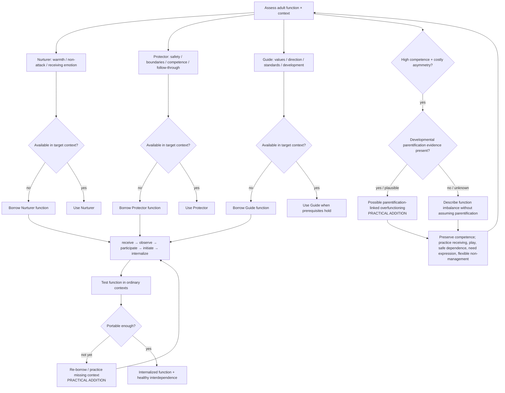

# Drill-down 02 — Adult-function architecture

Purpose: assess and build **Nurturer, Protector, and Guide as distinct functions**, including borrowed versus internal capacity, function-by-context availability, and possible parentification-linked overfunctioning.

## Function × context matrix

Do not ask only `does this person have an inner adult?` Ask which function is accessible **where**.

Suggested contexts:

- calm and alone;
- ordinary task pressure;
- shame after a mistake;
- conflict;
- romantic/attachment panic;
- exhaustion;
- receiving care;
- setting a boundary;
- disappointing another person;
- after missing a commitment;
- after a strong altered/depth experience.

A profile can be highly uneven. Examples:

- excellent Protector/Guide at work, collapsed Protector in attachment panic;
- strong Nurturer toward others, almost none toward self;
- strong Guide while calm, punitive inherited critic under shame;
- compulsive caregiving and responsibility with weak receiving, play, dependence, or vulnerability.

## Adult-function semantics

| Function | Primary jurisdiction in current article | Recognition of healthy access | Common failure / counterfeit | Primary fallback |
|---|---|---|---|---|
| Nurturer | Receives pain/emotion without attack | Warmth or at minimum non-cruelty; emotion can exist without earning care | Conditional warmth; soothing used to avoid necessary action; inherited shame voice masquerading as care | Borrow warmth/non-attack from a safe exemplar; start with `I will not attack you` |
| Protector | Safety, boundaries, competence, practical follow-through | Concrete proportional action; boundaries; ordinary life becomes safer/more reliable | Control/overfunctioning; compulsive caretaking; rigid self-management | One minimally competent action; borrow external structure/support |
| Guide | Values, direction, standards, learning, growth | Can choose difficult but proportionate action without exiling the child | Inherited critic, perfectionism, spiritual bypass, productivity ideology | Return to Nurturer/Protector prerequisites; use written calm-state values or a narrow borrowed Guide |

## Possible parentification-linked overfunctioning — `PRACTICAL ADDITION / KNOWN ROOT`

Broad parentification/compulsive caregiving is prior art. The operational consequence for this protocol is still important:

> Visible responsibility does not establish balanced integrated adulthood, but visible competence is also not evidence that the person's adulthood is fake.

The earlier shorthand `parentified pseudo-adult` is therefore **not** the bot's default label. It risks collapsing two questions:

1. Did the person actually carry developmentally disproportionate caregiving/responsibility in childhood?
2. Does the present adult-function profile remain costly, rigid or asymmetric now?

Keep them separate.

### A. Developmental-history evidence

Possible evidence for parentification includes:

- developmentally disproportionate **emotional** responsibility for a parent/caregiver;
- belief that a caregiver's emotional or physical well-being depended on the child;
- role reversal such as confidant, mediator, rescuer or emotional caretaker;
- disproportionate instrumental burden that could not realistically be declined;
- premature independence because adequate adult protection/support was unavailable;
- chronic unfairness/lack of recognition around responsibilities.

Parentification measures distinguish dimensions such as emotional versus instrumental caregiving, parent- versus sibling-focused roles, perceived unfairness, and perceived benefits. Definitions and outcomes vary across culture/context.

### B. Current function/context profile

A current overfunctioning pattern may include:

- compulsive caregiving/rescuing;
- guilt or fear when not managing another person's state;
- difficulty receiving care without repayment, management or loss of control;
- inability to ask for ordinary dependence/support despite need;
- Nurturer access much weaker toward self than toward others;
- Protector/Guide competence that becomes rigid under shame or attachment threat;
- little play, beginner tolerance, rest or permission to need;
- competence maintained through chronic overcontrol rather than flexible choice.

These features do not by themselves prove childhood parentification. If developmental history is unknown, describe the **function imbalance** rather than manufacturing an etiology.

### Preserve acquired strengths

Research on parentification is explicitly mixed: some people report or demonstrate responsibility, autonomy, practical skill, resilience or meaning alongside costs. The therapeutic target is therefore not `become less competent`.

Ask instead:

- Can the person **choose** responsibility rather than feel survival-compelled to take it?
- Can they receive care without immediately repaying/managing?
- Can they ask for help when appropriate?
- Can they rest/play/be a beginner without identity threat?
- Does competence remain accessible without crushing self-attack or hypercontrol?
- Does the function generalize flexibly rather than collapse in attachment/shame contexts?

Do **not** respond by simply prescribing more responsibility. Test whether the missing developmental work is Nurturer access, receiving, play, safe dependence, flexibility, or a context-specific Protector/Guide deficit.

## Function substitution / intervention mismatch — `PRACTICAL ADDITION / KNOWN PRIOR ART`

Schema Therapy provides direct prior art for matching interventions to active modes/needs and changing strategy when the current mode changes. Therefore the broad idea is not a novel mechanism.

The project-specific Nurturer/Protector/Guide matrix remains useful only as a **case-formulation heuristic**.

### Two-step mismatch check

When an intervention stalls, ask:

1. **What process/state is active?** Vulnerability/pain, actual danger or boundary problem, inherited attack/shame, avoidance/protection, ordinary practical problem, values/direction conflict, etc.
2. **What function is the current response supplying?** Nurture, protection/action, guidance/structure, or something else.

A mismatch becomes plausible when the response repeatedly fails to address the active need or predictably worsens the maintaining process.

Examples:

- Nurturer without Protector: reassurance/warmth while a real boundary or safety action remains undone;
- Protector without Nurturer: control/competence while emotion/need can only be met with more management;
- Guide without Nurturer/Protector: analysis/demands heard as the inherited critic while shame or safety failure is dominant;
- Nurturer used against Guide: soothing repeatedly becomes escape from a self-endorsed necessary action;
- Protector used against child contact: control permanently replaces any voluntary relationship/contact;
- problem-solving when the person was trying to contact and tolerate emotion rather than solve it.

### Outcome-based correction

Do not declare a mismatch merely because the theory predicts one. Use:

- the user's account of what the intervention did;
- whether the targeted need changed;
- ordinary functioning/action;
- whether the intervention intensified self-attack, avoidance, collapse or coercion;
- alternative explanations such as poor timing, misunderstanding, task size or the role model itself being a poor fit.

### Complexity falsifier

If `what process is active? → what response actually helps?` performs as well as the Nurturer/Protector/Guide substitution matrix with less rigidity/procedural burden, simplify the bot. The triad should earn its complexity.

## Developmental sequence and handback

The owner-locked sequence remains:

`receive → observe → participate → initiate → internalize`

Internalization means the **reparenting function becomes available from within**, increasingly across contexts. It does not mean:

- never needing therapy again;
- never needing co-regulation;
- never borrowing a function under exceptional stress;
- eliminating friendship/community/practical support.

Re-borrowing after severe stress can be maintenance/access restoration rather than evidence that learning never occurred.

## Non-withdrawable Nurturer — `PRACTICAL ADDITION / KNOWN PRIOR ART`

Protector and Guide can say `no`, set boundaries, choose difficult action, or correct behavior. Nurturer warmth/non-cruelty should not disappear as payment for compliance, success, gratitude, or agreement.

This is particularly important after mistakes and disagreement, when conditional parenting/inner criticism is easiest to reenact.

Evidence record: `../retrieval/REMAINING-PROTOCOL-GAPS-EXA-20260817.md` plus `../EVIDENCE-LEDGER.md`.
