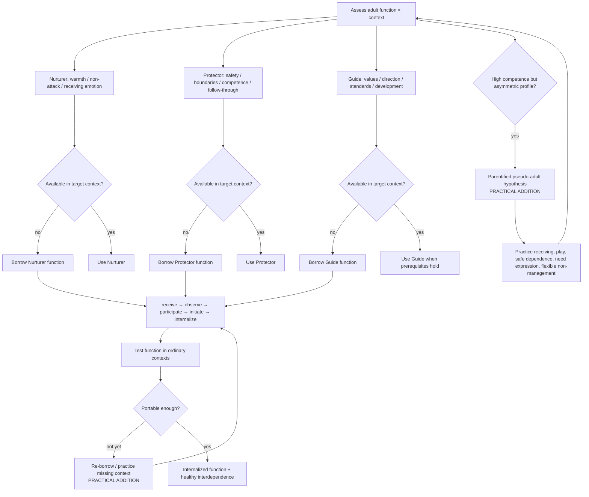

# Drill-down 02 — Adult-function architecture

Purpose: assess and build **Nurturer, Protector, and Guide as distinct functions**, including borrowed versus internal capacity, function-by-context availability, and parentified pseudo-adulthood.

## Function × context matrix

Do not ask only `does this person have an inner adult?` Ask which function is accessible **where**.

Suggested contexts:

- calm and alone;
- ordinary task pressure;
- shame after a mistake;
- conflict;
- romantic/attachment panic;
- exhaustion;
- receiving care;
- setting a boundary;
- disappointing another person;
- after missing a commitment;
- after a strong altered/depth experience.

A profile can be highly uneven. Examples:

- excellent Protector/Guide at work, collapsed Protector in attachment panic;
- strong Nurturer toward others, almost none toward self;
- strong Guide while calm, punitive inherited critic under shame;
- compulsive caregiving and responsibility with weak receiving, play, dependence, or vulnerability.

## Adult-function semantics

| Function | Primary jurisdiction in current article | Recognition of healthy access | Common failure / counterfeit | Primary fallback |
|---|---|---|---|---|
| Nurturer | Receives pain/emotion without attack | Warmth or at minimum non-cruelty; emotion can exist without earning care | Conditional warmth; soothing used to avoid necessary action; inherited shame voice masquerading as care | Borrow warmth/non-attack from a safe exemplar; start with `I will not attack you` |
| Protector | Safety, boundaries, competence, practical follow-through | Concrete proportional action; boundaries; ordinary life becomes safer/more reliable | Control/overfunctioning; compulsive caretaking; rigid self-management | One minimally competent action; borrow external structure/support |
| Guide | Values, direction, standards, learning, growth | Can choose difficult but proportionate action without exiling the child | Inherited critic, perfectionism, spiritual bypass, productivity ideology | Return to Nurturer/Protector prerequisites; use written calm-state values or a narrow borrowed Guide |

## Parentified pseudo-adult branch — `PRACTICAL ADDITION / KNOWN ROOT`

Broad parentification/compulsive caregiving is prior art. The operational consequence for this protocol is still important:

> Visible responsibility does not establish integrated adulthood.

Recognition pattern may include:

- high responsibility, caretaking, planning, control, or competence;
- difficulty receiving care without repayment or management;
- shame around need, play, dependence, rest, or being a beginner;
- strong Protector/Guide-like behavior that becomes rigid under attachment threat or shame;
- child access remaining poor despite apparent maturity.

Do **not** respond by simply prescribing more responsibility. Test whether the missing developmental work is Nurturer access, receiving, play, safe dependence, or flexibility.

## Function substitution — `PRACTICAL ADDITION / RESEARCH NEEDED`

A therapy bot should ask whether one function is being overused in place of another:

- Nurturer without Protector: warmth without making life safer;
- Protector without Nurturer: control and competence without felt care;
- Guide without Nurturer/Protector: demands and direction that resemble the inherited critic;
- Nurturer used against Guide: soothing becomes a reason never to face chosen difficulty;
- Protector used against child contact: permanent control replaces relationship.

This is a diagnostic matrix, not a claim that any one pattern proves pathology.

## Developmental sequence and handback

The owner-locked sequence remains:

`receive → observe → participate → initiate → internalize`

Internalization means the **reparenting function becomes available from within**, increasingly across contexts. It does not mean:

- never needing therapy again;
- never needing co-regulation;
- never borrowing a function under exceptional stress;
- eliminating friendship/community/practical support.

Re-borrowing after severe stress can be maintenance/access restoration rather than evidence that learning never occurred.

## Non-withdrawable Nurturer — `PRACTICAL ADDITION / KNOWN PRIOR ART`

Protector and Guide can say `no`, set boundaries, choose difficult action, or correct behavior. Nurturer warmth/non-cruelty should not disappear as payment for compliance, success, gratitude, or agreement.

This is particularly important after mistakes and disagreement, when conditional parenting/inner criticism is easiest to reenact.
