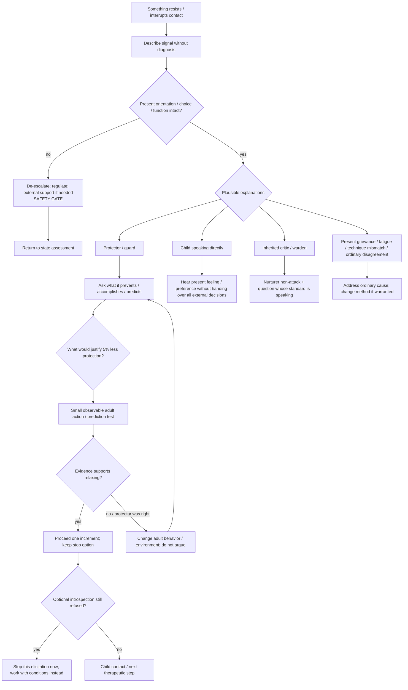

# Drill-down 03 — Protector / resistance handling

Purpose: work with distrust, numbness, inherited criticism, proactive protection, reactive escape, dissociation-like disconnection, and urges to leave/use/scroll/etc. without either **bulldozing the response** or **automatically reinforcing avoidance**.

## Signals that may have protective meaning

The article already names:

- cynicism / `this is stupid`;
- numbness or silence;
- intellectualization;
- sudden phone/scroll urge;
- substance urge;
- sudden relationship/project fixation;
- anger;
- sexual acting-out urge;
- planning/fixing/hunger/sleep;
- dissociation-like disconnection;
- desire to leave the exercise.

These are **signals**, not automatic protector diagnoses.

## Differential before classification

The bot should preserve at least these live hypotheses:

1. proactive protector trying to prevent humiliation, deception, overwhelm, abandonment, or loss of control;
2. reactive escape trying to move attention away from pain that exceeds current holding capacity;
3. child-state direct refusal/anger/fear;
4. inherited critic or warden attacking vulnerability;
5. present-day grievance that is actually accurate;
6. ordinary fatigue, distraction, bodily need, or lack of interest;
7. technique/delivery mismatch;
8. the bot's own interpretation is wrong.

**Contestability rule — PRACTICAL ADDITION / KNOWN PRIOR ART:** if the user says the protector framing does not fit, confidence in that framing goes down. Do not reinterpret disagreement as confirmation of a hidden protector.

## Proactive protection

Recognition pattern:

- on duty before material gets close;
- skeptical, analytical, controlling, perfectionistic, or dismissive;
- often has a history of correctly predicting abandonment, inconsistency, self-deception, or overenthusiastic methods that later disappear.

Primary action:

- acknowledge competence/history;
- ask what failure it predicts;
- make the prediction observable;
- improve actual adult reliability rather than demanding trust.

## Reactive escape

Recognition pattern:

- urge sharply increases as painful material approaches;
- attention is pulled toward immediate relief, action, use, contact, scrolling, sleep, anger, sexuality, or a new project;
- can coexist with genuine practical needs.

Primary action:

- do not shame the urge;
- check whether the person remains oriented and able to choose;
- lower intensity when capacity is being lost;
- use one Nurturer/Protector action before deciding whether to resume.

## The difficult conflict: protection versus avoidance

The current article correctly says not to push through guards, but a bot also needs an exit criterion from endless retreat.

### Current safe rule

- **If orientation, meaningful choice, or ordinary function is degrading:** de-escalate. Do not use exposure logic to justify continuing.
- **If the person remains oriented and chooses to explore:** ask for a very small increment and preserve the ability to stop.
- **If optional introspection is clearly refused:** do not force it. Shift the task from `go deeper` to `what would make this safer or worth revisiting?`
- **If a necessary external responsibility remains:** internal reluctance does not erase the adult's responsibility for proportionate external action. Nurturer care stays available during and after it.

### Live candidate — `PROVISIONAL / RESEARCH NEEDED`

A refusal to optional introspection might be handled as:

`stop now → record what is being protected → define a non-coercive condition for possible re-entry → revisit later only if that condition is met and the person still chooses it`.

This could prevent `respect the no` from silently becoming permanent avoidance, but it could also become a disguised coercive retry loop. It is **not** yet a hard runtime rule.

## Conditions for proceeding deeper

Proceed only when all are reasonably true:

- present orientation remains intact;
- the person can stop or change course;
- distress is tolerable enough that the adult/witness function remains available or can be borrowed;
- the response has been heard rather than relabelled as an obstacle;
- no immediate practical safety action is being deferred by the exercise;
- the next increment has a clear purpose rather than intensity for intensity's sake.

## Do not do

- `Your protector is blocking you, so we need to get past it.`
- `Your urge proves trauma is close.`
- `If you disagree, that is another part resisting.`
- force imagery, memory search, confession, forgiveness, or emotional intensity;
- treat a substance/scroll/sexual/relationship urge as either meaningless or automatically therapeutic progress;
- let `Guide` become a license for internal coercion.
