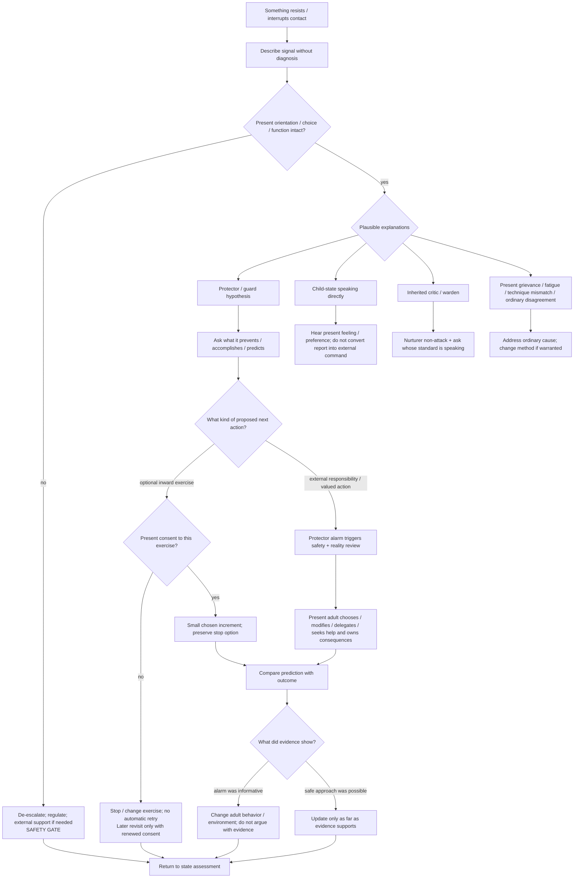

# Drill-down 03 — Protector / resistance handling

Purpose: work with distrust, numbness, inherited criticism, proactive protection, reactive escape, dissociation-like disconnection, and urges to leave/use/scroll/etc. without either **bulldozing the response** or **automatically reinforcing avoidance**.

The current architecture deliberately uses a **thin adult-led interface contract**, not an `internal constitution`. IFS Self-leadership, Schema Healthy Adult, Transactional Analysis/ego-state work, ACT, autonomy-supportive parenting, and shared-decision/informed-consent models already cover most of the useful structure. The role labels are working perspectives/functions, not authenticated inner persons with legal-style jurisdiction.

## Signals that may have protective meaning

The article already names:

- cynicism / `this is stupid`;
- numbness or silence;
- intellectualization;
- sudden phone/scroll urge;
- substance urge;
- sudden relationship/project fixation;
- anger;
- sexual acting-out urge;
- planning/fixing/hunger/sleep;
- dissociation-like disconnection;
- desire to leave the exercise.

These are **signals**, not automatic protector diagnoses.

## Differential before classification

The bot should preserve at least these live hypotheses:

1. proactive protector trying to prevent humiliation, deception, overwhelm, abandonment, or loss of control;
2. reactive escape trying to move attention away from pain that exceeds current holding capacity;
3. child-state direct refusal/anger/fear;
4. inherited critic or warden attacking vulnerability;
5. present-day grievance that is actually accurate;
6. ordinary fatigue, distraction, bodily need, or lack of interest;
7. technique/delivery mismatch;
8. the bot's own interpretation is wrong.

**Contestability rule — PRACTICAL ADDITION / KNOWN PRIOR ART:** if the user says the protector framing does not fit, confidence in that framing goes down. Do not reinterpret disagreement as confirmation of a hidden protector.

## Thin adult-led interface contract — `PRACTICAL ADDITION / REJECTED FOR NOVELTY`

This is the minimum conflict-resolution layer retained after Exa collision and independent Parallel Task falsification. It is an **interface for decisions**, not a claim that the mind literally contains separate constitutional offices.

1. **States report; the present adult integrates.** Affect, sensation, preference, memory, imagery and prediction are meaningful data. A report is not automatically an external fact or command.
2. **Optional inward work requires present consent.** Imagery, memory exploration, journaling, hypnosis, parts dialogue or other optional introspection can be paused, changed or declined.
3. **A refusal triggers inquiry, not automatic obedience or automatic override.** Ask whether it reflects current danger, insufficient capacity, a boundary, values conflict, uncertainty, ordinary dislike, technique mismatch, or avoidance.
4. **Protector alarms trigger review.** They can interrupt and request a safety/reality check; they do not prove danger or impose a permanent veto on all approach.
5. **Guide proposes; the adult commits.** Guide can surface values, direction and a difficult but proportionate step. It cannot compel introspection or use `growth` as a license for coercion.
6. **Nurturer care remains available.** Care/non-cruelty is not payment for cooperation. Behavior, spending, substance use, commitments or other actions can still have limits.
7. **External responsibility stays external.** The present adult owns actions, promises, effects on other people, and consequences. Internal language cannot erase another person's consent or a real obligation.
8. **Use provisional / as-if language.** `A frightened part of me predicts danger` is safer than `the Protector has established danger`. Parts are useful phenomenological lenses, not historical witnesses or diagnoses by default.
9. **Review outcomes.** Compare what was predicted with what happened; update the formulation rather than protecting the role model from disconfirmation.

### Authority is not the same as voice

A child-state can have privileged first-person standing about **how something feels now**, what it wants, what it fears, and what relational meaning it perceives. That does not make the state automatically authoritative about:

- whether an external danger exists;
- what historically happened;
- diagnosis;
- legal/financial obligations;
- what another person consents to;
- the best long-range action.

Likewise, a Protector's fear or prediction deserves examination without becoming proof. The present adult integrates internal reports with current facts, values, obligations, appropriate expertise, time pressure, reversibility, and consequences.

## Proactive protection

Recognition pattern:

- on duty before material gets close;
- skeptical, analytical, controlling, perfectionistic, or dismissive;
- often has a history of correctly predicting abandonment, inconsistency, self-deception, or overenthusiastic methods that later disappear.

Primary action:

- acknowledge competence/history;
- ask what failure it predicts;
- make the prediction observable;
- improve actual adult reliability rather than demanding trust.

## Reactive escape

Recognition pattern:

- urge sharply increases as painful material approaches;
- attention is pulled toward immediate relief, action, use, contact, scrolling, sleep, anger, sexuality, or a new project;
- can coexist with genuine practical needs.

Primary action:

- do not shame the urge;
- check whether the person remains oriented and able to choose;
- lower intensity when capacity is being lost;
- use one Nurturer/Protector action before deciding what to do next.

## The difficult conflict: protection versus avoidance

The article correctly says not to bulldoze guards. Evidence from exposure-based treatment also shows that automatic escape from safe, chosen approach can maintain fear/avoidance. Neither fact yields a universal rule to `push through` or `stop whenever distressed`.

### Current safe rule

- **If orientation, meaningful choice, or ordinary function is degrading:** de-escalate. Do not use exposure logic to justify continuing.
- **If an optional introspective exercise is refused:** stop or change that exercise. Do not convert the refusal into a scheduled retry, `care debt`, or proof of pathology. A later invitation requires renewed consent and should have a fresh rationale, changed conditions, or a different method rather than functioning as an automatic loop.
- **If the person remains oriented and actively chooses to explore:** a small, purpose-linked increment can be tried with the ability to stop.
- **If a necessary external responsibility or self-endorsed valued action remains:** internal reluctance is important information but does not erase the adult's responsibility. Run a safety/reality review, then choose a proportionate method, delegate, renegotiate where legitimately possible, or seek help. Nurturer care stays available throughout.
- **Do not improvise formal trauma exposure merely because avoidance is suspected.** The anti-avoidance principle is a formulation safeguard, not permission for a therapy bot to invent exposure treatment.

### Re-entry after `not now` — resolved practical rule

The earlier candidate proposed predefining a condition that would automatically reopen introspection later. Independent hostile review identified a meaningful coercion risk: a nominally respected `no` can become only a delayed `yes` if the protocol has already committed to retrying.

Current rule:

`stop / change the optional exercise now → understand what mattered if the person wants to → continue life/support without arrears → revisit only if renewed consent exists`

A later invitation is allowed; a later attempt is not owed.

Strict originality: **rejected**. The practical value comes from combining consent, anti-avoidance and external-responsibility distinctions cleanly, not from a novel mechanism.

## Conditions for proceeding deeper

Proceed only when all are reasonably true:

- present orientation remains intact;
- the person can stop or change course;
- distress is tolerable enough that adult/witness capacity remains available or can be borrowed;
- the response has been heard rather than relabelled as an obstacle;
- no immediate practical safety action is being deferred by the exercise;
- the next increment has a clear therapeutic purpose rather than intensity for intensity's sake;
- the person presently consents to that particular inward step.

## Falsification / complexity test for the interface contract

Compare the role-specific interface with a simpler rule:

> Notice feelings and needs; reality-test danger; choose values-guided action; keep care unconditional; the present adult owns external decisions.

The added Nurturer/Protector/Guide interface should be simplified or removed if it repeatedly produces more:

- avoidance or reassurance rituals;
- shame/coercion;
- literal reification of parts;
- certainty about ambiguous memories;
- decision delay / internal procedural burden;
- external-functioning impairment;

without improving clarity, safe approach, self-endorsed action, trust repair or autonomy.

## Do not do

- `Your protector is blocking you, so we need to get past it.`
- `Your urge proves trauma is close.`
- `If you disagree, that is another part resisting.`
- `The child said no, therefore every external obligation is cancelled.`
- `The Guide knows what you must do.`
- force imagery, memory search, confession, forgiveness, hypnosis, or emotional intensity;
- treat a substance/scroll/sexual/relationship urge as either meaningless or automatically therapeutic progress;
- make withdrawal of care the consequence for refusal;
- turn `adult leadership` into humiliation, moral pressure, or invalidation.

Evidence record: `../retrieval/INTERNAL-JURISDICTION-PARALLEL-FULL-20260817.md` plus `../retrieval/PROTOCOL-HARDENING-EXA-20260817.md`.
