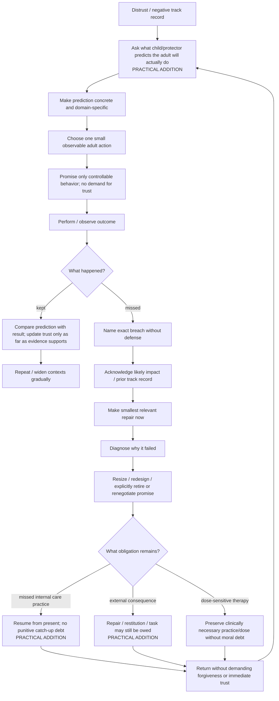

# Drill-down 04 — Trust, promises, rupture, and repair

Purpose: make trust-building falsifiable and specify what happens after the inner adult inevitably misses a commitment.

## Prediction-based trust repair — `PRACTICAL ADDITION / KNOWN PRIOR ART`

Instead of persuading a skeptical child/protector:

1. ask what it predicts the adult will actually do;
2. specify the situation and behavior;
3. choose a small test;
4. carry out the behavior;
5. compare prediction and result;
6. update trust only as far as the evidence supports.

If the protector predicted failure correctly, **change adult behavior** rather than arguing that the protector should be more trusting.

Trust is also context-specific. Reliability around bedtime or work does not automatically transfer to money, attachment panic, conflict, substance urges, or boundaries.

## Promise design

Prefer commitments that are:

- behaviorally observable;
- substantially under present control;
- small enough to repeat at the demonstrated level of capacity;
- connected to the concern actually raised;
- explicit about when/how they will be reviewed.

Avoid promises such as:

- `I will never fail you again`;
- `I will always feel loving`;
- `I will never become dysregulated`;
- promises whose success depends on another person's reaction;
- escalating to a grander vow immediately after a breach.

## Broken-promise repair — `PRACTICAL ADDITION / KNOWN RUPTURE-REPAIR ROOT`

A missed promise should not disappear from the protocol. Use:

`promise → miss → acknowledgment → impact → repair → failure diagnosis → resize/renegotiate → return`

not:

`promise → miss → shame → bigger promise`.

Alliance-rupture research strongly supports the general importance of recognizing ruptures, accepting responsibility where appropriate, exploring their impact, and restoring collaboration. The transfer from therapist-client rupture to an internal self-relationship is an architectural application, not a novel mechanism claim.

### Failure diagnosis after a miss

Ask which explanation best fits rather than assuming moral failure:

- promise too large or vague;
- target not substantially controllable;
- environment made success unlikely;
- forgotten/cue failure;
- exhaustion or competing capacity demand;
- protector/avoidance process;
- Guide goal did not actually fit the person's values;
- missing Nurturer/Protector support;
- wrong sequencing;
- technique/delivery mismatch;
- genuine emergency or changed reality.

## Explicit renegotiation

Do not silently behave as though the old promise never existed.

If it was unrealistic:

1. name that the contract is changing;
2. say what reality taught you;
3. retire or resize the old commitment;
4. make the new commitment observable;
5. let trust update from what happens next.

This distinguishes honest learning from moving the goalposts.

## No-arrears rule — `PRACTICAL ADDITION / REJECTED FOR NOVELTY`

Exa semantic collision plus independent Parallel Task falsification found no recognized named reparenting/IFS `no-arrears rule`, but the component logic is already strongly represented by CBT homework troubleshooting, relapse-prevention lapse handling, self-compassion after failure, graded behavioral activation, goal re-engagement, and ordinary habit-return advice. Exposure/ERP evidence supplies the crucial limitation that adequate therapeutic practice can matter.

Current rule:

> **Abolish punitive accumulation, not accountability or therapeutic dose.** A missed reparenting/self-care practice does not automatically create catch-up debt. Name the miss, diagnose what it reveals, repair any actual breach, and choose a present-tense next action that still serves the therapeutic function.

### Three separate accounting questions

1. **Internal care practice:** a missed journaling/reparenting/check-in session usually does not mean the person now `owes` multiple compensatory sessions. Resume from the present and redesign if misses repeat.
2. **External consequence:** if the miss harmed somebody, left a bill unpaid, violated an agreement, or created another concrete obligation, appropriate repair/restitution/action can remain due.
3. **Dose-sensitive treatment:** an evidence-based treatment may require sufficient total practice/exposure/repetition. Preserve that therapeutic requirement through planning/rescheduling; do not translate it into shame or moral debt.

Repeated misses are **trend data**. They increase the need to reformulate capacity, avoidance, task design, support, sequencing, environmental barriers or treatment fit. They do not justify endless identical retries.

Evidence record: `../retrieval/NO-ARREARS-EXA-PARALLEL-20260817.md`.

## Success signals

- smaller gap between prediction and reliable adult behavior;
- distrust can be expressed without adult retaliation/collapse;
- promises become more realistic rather than grander;
- misses are acknowledged faster;
- repair behavior increases;
- trust becomes evidence-sensitive instead of reassurance-sensitive;
- a breach no longer automatically ends the whole practice;
- missed practice does not generate punitive backlog while needed therapeutic dose/accountability is still preserved.

## Failure signals

- repeated promises with no environmental/behavioral change;
- shame followed by compensatory overpromising;
- redefining the promise after failure to preserve a `success` narrative;
- demanding gratitude/forgiveness/trust after repair;
- using no-arrears to evade external responsibility;
- using no-arrears to eliminate a dose-dependent treatment mechanism;
- globalizing one success into `the adult is now trustworthy everywhere`.
