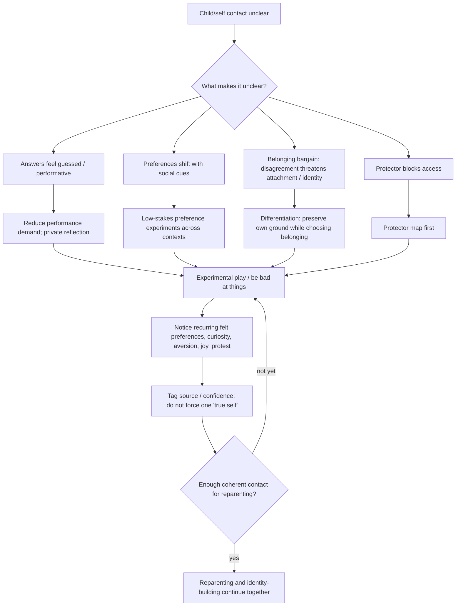

# Drill-down 05 — Identity and differentiation

Purpose: route cases where there is no clear child/self to contact, the performed self dominates, or belonging pressure obscures preference and choice.

## Recognition conditions

This branch becomes relevant when several of these are present:

- self-love practice feels like performance rather than contact;
- `what do I want?` is answered mainly through another person's desire/disapproval;
- preferences/beliefs/feelings change sharply across social contexts;
- agreeing in the moment is followed by later private disagreement;
- the answer to `what does the child feel?` is guessed rather than felt;
- mistakes, beginner status, play, or harmless experimentation feel unusually threatening to belonging/worth;
- caretaking/achievement/beauty/spirituality/intelligence/etc. function as conditions for belonging or value.

These are hypotheses about identity development/differentiation, not proof that a hidden `true self` exists fully formed underneath.

## Primary actions — `CURRENT ARTICLE`

- private journaling without an imagined audience;
- periods of reflection with reduced external input;
- time in nature if useful;
- recover low-stakes preferences (food, activity, aesthetics, beliefs, feelings);
- experiment with hobbies/roles/skills where there is no requirement to impress;
- give a new interest enough repetitions to get past beginner humiliation;
- practice disagreement and remaining recognizably oneself inside relationships/groups where safe;
- use temporary distance when a system does not permit differentiation from inside, with careful attention to support and consequences.

## Safety correction: differentiation is not default isolation

`SAFETY / EPISTEMIC GATE`

The article allows temporary distance. For bot routing, strengthen the distinction:

- reduce **coercive or identity-overwriting input** when needed;
- preserve chosen supportive relationships where possible;
- do not prescribe broad social withdrawal merely because preferences are unclear;
- consider practical dependence, safety, disability, finances, culture, family responsibilities, and the person's actual support network;
- distance is a tool, not proof of authenticity.

The goal is enough room for self-development, not loneliness as a purity test.

## Felt sense and epistemic status — owner-locked distinction

Preserve both propositions:

1. a felt sense **may know what the conditioned self was trained to forget**;
2. a felt sense is not by itself historical proof or a guarantee that one preference is uniquely `authentic` for all contexts/time.

Useful evidence for a preference can include:

- recurrence across time;
- recurrence across different social contexts;
- behavior when external reward/approval is absent;
- what remains after the immediate threat of disappointing somebody decreases;
- curiosity/energy that persists after beginner discomfort;
- willingness to bear some cost for the preference.

This is reliability evidence, not a requirement that every real preference be stable forever.

## Differentiation and belonging

Operational target:

- other people's emotion/opinion no longer automatically replaces one's own;
- care for others can coexist with disagreement;
- disappointment can be tolerated without automatic self-erasure;
- group/family/religious/political identity can be questioned without assuming total exile is required;
- leaving remains available when staying genuinely requires disappearance.

The bot should not decide for the user whether a family, religion, partner, or community is safe enough to remain in based on a single internal exercise.

## Positive identity development

Do not make identity work a forensic search for childhood damage. Include:

- play;
- silliness;
- beauty;
- trying things badly;
- curiosity;
- celebration;
- low-stakes choice;
- boredom as information;
- changing one's mind without treating it as failure.

Identity can be **built** through experimentation as well as recovered through reflection.
