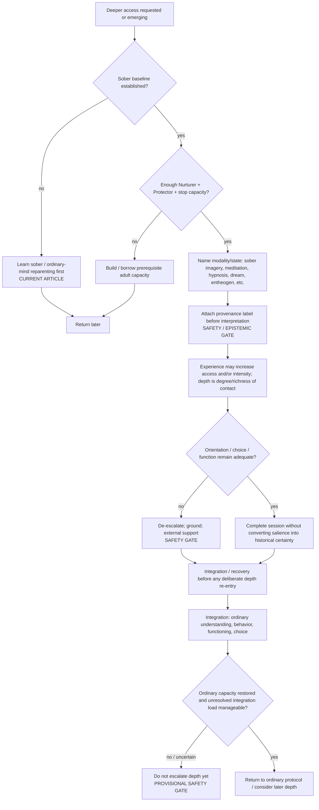

# Drill-down 06 — Depth / altered-state architecture

Purpose: keep sober baseline, experiential access/depth/intensity, integration, destabilization, and historical provenance separate.

## Owner-locked conceptual axes

Do not collapse these:

- **Access** — what material becomes reachable.
- **Intensity** — strength/vividness/charge of experience.
- **Depth of experience** — richness/degree of contact with the material, normally involving access and/or intensity.
- **Integration** — what becomes incorporated afterward into ordinary understanding, behavior, functioning, and choice.

A deep experience can integrate poorly. A mild experience can integrate well. An altered state may reach material the daytime practice did not reach without proving that its apparent narrative is historically literal or that greater intensity is clinically better.

Retrieved psychedelic literature provides an important counterweight against simplistic caution: acute mystical/intense experience can correlate with clinical improvement on average in some psychedelic-assisted-treatment datasets. Therefore the protocol should not classify intensity itself as pathology. The safety issue is **what happens to orientation, ordinary function, choice, adverse effects and subsequent integration**, not whether the experience was strong.

## Sober baseline gate — `CURRENT ARTICLE`

Before deliberately amplifying depth:

- the person can do at least a minimal sober version of the practice;
- enough Nurturer/Protector capacity exists internally or through grounded support;
- the person can stop, orient, and return to ordinary functioning;
- there is a plan for what happens if material exceeds current capacity;
- nobody lending support receives automatic authority over interpretation.

For a therapy bot, `altered state` should trigger **more conservative epistemic handling**, not more confident interpretation.

## Provenance at ingestion — `SAFETY / EPISTEMIC GATE · KNOWN PRIOR ART`

Source-monitoring and false-memory research substantially supports this safeguard. Mental content does not arrive with an infallible intrinsic source label; people infer where a memory-like experience came from. Vivid imagination, repetition, suggestion and source similarity can increase attribution errors. This does **not** make therapeutic imagery inherently memory-corrupting: transparent, patient-authored imagery/rescripting can preserve the distinction between the original memory and newly constructed material.

Record experiential material by source type at first capture:

- direct autobiographical memory;
- something another person said/testimony;
- inference;
- photograph/video observation;
- imagination/constructed caregiver/rescripting;
- bodily felt sense;
- dream;
- hypnosis/self-hypnosis;
- meditation/vision;
- entheogenic/other altered-state content;
- metaphor/symbolic material;
- uncertainty / unknown.

A later retelling should not silently erase the original source label. Track `confidence` or `meaning` separately if useful; neither overwrites `source_type`. High confidence or emotional force does not convert imagery/dream/altered-state content into direct memory.

## Historical-memory safeguard — `SAFETY / EPISTEMIC GATE`

- Do not ask leading questions such as `what abuse must have happened?`.
- Do not repeatedly interrogate an image until a story appears.
- Do not treat bodily activation, felt sense, dream imagery, hypnosis, or entheogenic material as proof of a forgotten event.
- Preserve direct memory, testimony, inference, imagery, metaphor, and uncertainty as distinct.
- A serious allegation should not be made solely from material generated in the practice.
- The owner's modal claim remains: felt sense **may** surface something conditioning obscured. The safeguard limits certainty, not that possibility.

## Destabilization conditions

Route toward de-escalation/support when the practice produces meaningful movement toward:

- loss of present orientation;
- inability to stop or disengage;
- escalating compulsive searching/interpretation;
- severe or persisting sleep/function disruption;
- increasing fragmentation rather than usable differentiation;
- growing dependency on a helper/interpreter/state to know what is `true`;
- escalating certainty unsupported by source provenance;
- repeated strong experiences without recovery/integration.

Do not call destabilization `going deeper` merely because the experience is intense.

## Integration-load gate — `PROVISIONAL / SAFETY SUPPORT · REJECTED FOR NOVELTY`

Retrieved psychedelic-integration and adverse-event literature supports the **problem** but not a universal algorithm. Integration can remain active for weeks or longer; challenging material and destabilization can outlast the acute experience; specific integration frameworks remain under-validated. No evidence found justifies a universal `wait X days` rule.

Current operational rule:

> Before deliberately escalating depth again, assess whether ordinary orientation, meaningful choice, sleep/function, and access to needed adult capacities have substantially returned, and whether unresolved high-salience material can be held without compulsive interpretation. If not, prioritize integration/recovery/support rather than further access.

Possible recognition signals for unresolved load:

- unfinished functional disruption from prior session;
- persistent compulsion to interpret or recreate the state;
- sleep/recovery not restored;
- unresolved high-stakes decisions generated in the state;
- adult functions less accessible afterward;
- more material accumulating than can be reflected on or acted on coherently;
- increasing reliance on the same state/helper to determine what is real or meaningful.

### Re-entry criterion

Do **not** require zero distress. A person can still be integrating while functioning well enough for ordinary life. The current gate asks whether deliberate escalation is likely to outrun present capacity.

Do not invent a numeric `integration debt` score or fixed waiting interval without evidence.

## Sober review of high-stakes outputs

A practical safeguard, not a novelty claim:

Irreversible relationship, identity, accusation, medical, financial, or major life decisions generated primarily in dreams/hypnosis/panic/entheogenic states should normally be revisited sober and sufficiently regulated before action, unless immediate present safety requires prompt action.

This does not mean altered-state insights are false. It prevents state intensity from substituting for deliberation.

Evidence record: `../retrieval/PROTOCOL-HARDENING-EXA-20260817.md`, sections 2 and 4.
