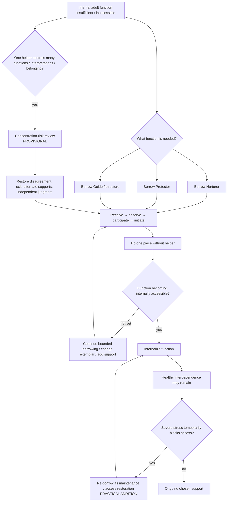

# Drill-down 07 — External-support architecture

Purpose: distinguish borrowed adulthood, therapy/peer/friend/community support, healthy interdependence, authority dependency, helper-concentration risk, and eventual internalization of the reparenting function.

## Support types are not interchangeable

### Therapist

May provide:

- skilled relational care;
- formulation and technique;
- trauma-informed pacing;
- clinical assessment within actual competence;
- structured repair when the therapeutic relationship ruptures.

Should not become automatic authority over:

- historical truth from ambiguous imagery;
- spiritual/metaphysical claims;
- every relationship choice;
- the person's total moral/political identity;
- medical domains outside competence.

### Peer / Hearthwork-style support

Current article model:

- presence/warmth can lend Nurturer;
- confidentiality, time boundaries and respect for `no` can lend Protector;
- the peer does **not** supply the user's Guide or decide what experience means;
- roles switch, reducing permanent parent/child asymmetry.

### Friend / community

Can provide ordinary affection, companionship, practical help, co-regulation, belonging, play, and reality contact. These supports can remain permanently external without implying failed reparenting.

### Borrowed exemplar / symbolic figure

Can model one function through memory, imagination, fiction, spiritual symbolism, future self, written plan, or another representation. Constructed imagery is for present repair; it is not historical evidence about childhood.

## Internalization versus interdependence — owner-locked distinction

The developmental path remains:

`receive → observe → participate → initiate → internalize`

The target is the **internal reparenting function**, not isolation from other humans.

Healthy interdependence can include continuing:

- therapy;
- friendship;
- community;
- co-regulation;
- practical assistance;
- consultation;
- spiritual fellowship;
- disability-related or other long-term support.

The relevant question is whether support preserves and expands the person's judgment/capacity, not whether all support disappears.

## Authority-dependency indicators

Potential warning signs:

- inability to disagree without fearing loss of care/belonging;
- helper opinion automatically outranks one's own observation or multiple independent sources;
- helper expands from one useful function into authority over memories, medicine, relationships, spirituality, identity, money, etc.;
- leaving the method/helper becomes framed as pathology, betrayal, lack of healing, or proof the helper was right;
- person becomes less able to initiate ordinary adult action without helper ratification;
- ambiguous memory/altered-state material is interpreted toward the helper's preferred narrative;
- helper becomes the only meaningful source of belonging.

## External-helper concentration risk — `PROVISIONAL / RESEARCH NEEDED`

Live candidate:

> Risk may increase when one person simultaneously becomes Nurturer, Protector, Guide, interpreter of ambiguous memories/experiences, and primary source of belonging.

The broad idea of authority concentration/dependency is not novel. The unresolved question is whether the **bundled function profile** gives a useful therapy-specific diagnostic beyond generic dependency/transference/undue influence.

Until researched, practical safeguards include:

- keep borrowed functions narrow;
- preserve independent sources of information and relationship;
- keep medical/legal/high-stakes judgments in the appropriate domains;
- preserve the ability to disagree and exit;
- distinguish `this person made me feel safe here` from `this person is wise about everything`.

Do not require artificial diversification if one stable therapist is appropriate; concentration is a risk factor to examine, not proof of harm.

## Re-borrowing after stress — `PRACTICAL ADDITION / KNOWN ROOT`

Previously internalized capacity can become temporarily inaccessible under severe stress. Re-borrowing a Nurturer/Protector/Guide function can restore access without changing the developmental target.

The bot should distinguish:

- **capacity never acquired**;
- **capacity acquired but not generalized to this context**;
- **capacity acquired/generalized but temporarily inaccessible under overload**.

These imply different next steps.

## Handback / success signals

- person can name what the helper did rather than only `they make me feel better`;
- person performs a small version independently;
- person can disagree without losing self-ground;
- person can ask for help without surrendering judgment;
- the function generalizes to additional contexts;
- loss/unavailability of the helper is painful but does not erase all access to the function;
- external support becomes chosen interdependence rather than compulsory authority.
