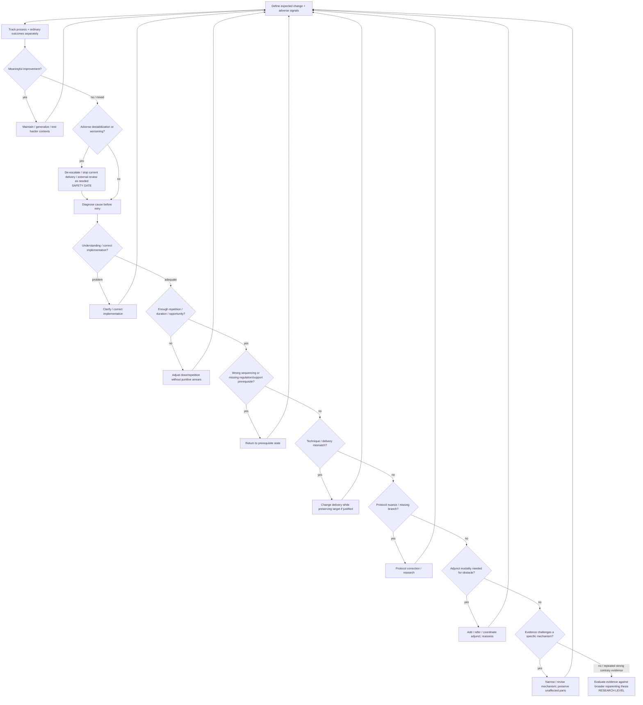

# Drill-down 08 — Outcome / failure-diagnosis architecture

Purpose: prevent `it did not work` from collapsing many distinct failure hypotheses into `abandon reparenting`, while still allowing evidence to challenge specific mechanisms and eventually the broader model.

## Owner-locked failure differential

At minimum keep these hypotheses distinct:

1. misunderstanding;
2. incorrect implementation;
3. inadequate repetition / dose / duration;
4. wrong sequencing;
5. missing prerequisite regulation/support;
6. technique or delivery mismatch;
7. missing protocol nuance / protocol improvement needed;
8. adjunct therapy/modality needed for a current obstacle;
9. evidence against a specific proposed mechanism;
10. only after substantially stronger evidence, a challenge to the broader target/model.

The owner's thesis is that if the inner-child / inner-adult relationship is dysfunctional, some form of reparenting is ultimately required. Record this as an **owner thesis to be tested**, not as empirical proof that can absorb all contrary evidence.

## What to measure

Do not use one proxy as the outcome.

### Adult-function process

- Nurturer access / reduction in self-attack;
- Protector follow-through / boundaries / practical safety;
- Guide access without punitive criticism;
- function portability across contexts;
- ability to receive as well as give care;
- use of external support without surrendering judgment.

### Relationship / trust process

- child/protector can disagree or distrust without retaliation;
- promises become smaller/more reliable;
- broken promises are acknowledged and repaired;
- prediction accuracy changes as adult behavior changes;
- ordinary positive contact occurs outside crisis.

### Identity / differentiation

- clearer private preferences where previously absent;
- more ability to experiment/play/be a beginner;
- less automatic replacement of own judgment by social pressure;
- ability to remain in or leave relationships/groups without disappearing into them.

### Ordinary outcomes

- functioning;
- choice/flexibility;
- relationships;
- avoidance/compulsion;
- recovery after activation;
- capacity to meet responsibilities without self-attack;
- quality of life relevant to the person's own goals.

### Separate experiential axes

Track separately:

- access;
- intensity;
- experiential depth;
- integration.

A peak experience is not a substitute for ordinary outcome data.

## Adverse / failure signals that override `just keep practicing`

Examples warranting de-escalation, delivery change, and/or qualified external review:

- declining orientation or ability to stop;
- increased compulsive interpretation or memory hunting;
- growing certainty that ambiguous experiential material is historical fact;
- increasing fragmentation/identity confusion attributable to the practice;
- dependency on one helper/state/interpreter to know what is true;
- meaningful deterioration in sleep, work, relationships, self-care, or safety;
- repeated shame/overpromising cycles after missed practices;
- practice fluency increasing while agency and ordinary life worsen.

These signals do **not** automatically disprove the entire reparenting target. They do mean the current implementation cannot be defended merely by saying `resistance is part of healing`.

## Failure-localization fields for a bot

For each unsuccessful intervention eventually capture conceptually:

- `expected_change`;
- `what_actually_happened`;
- `implementation_confidence`;
- `repetition_duration`;
- `prerequisite_state`;
- `adult_function_available`;
- `context`;
- `adverse_signals`;
- `alternative_explanations`;
- `next_hypothesis_to_test`;
- `fallback_action`;
- `evidence_that_would_change_model`.

## Evidence escalation rule

Do not protect the model by endlessly moving failure into `not enough practice`. Conversely, do not treat one failed exercise as a decisive model refutation.

A broader challenge becomes more credible when contrary outcomes persist despite:

- a clearly understood target;
- reasonably verified implementation;
- adequate opportunity/repetition for the proposed mechanism;
- correct prerequisite sequencing;
- more than one delivery strategy when technique-specific failure is plausible;
- relevant support/adjunct barriers addressed where feasible;
- measurement that includes adverse effects as well as intended outcomes.

The threshold is evidentiary, not a fixed number of sessions invented by the bot.

## Outcomes of the diagnostic tree

A poor result should end in one of these dispositions, not one generic `failure`:

- `IMPLEMENTATION CORRECTION`;
- `MORE / DIFFERENT REPETITION`;
- `RETURN TO PREREQUISITE`;
- `DELIVERY CHANGE`;
- `PROTOCOL CORRECTION`;
- `ADJUNCT SUPPORT`;
- `SPECIFIC MECHANISM NARROWED / REJECTED`;
- `BROADER MODEL CHALLENGE`;
- `INSUFFICIENT EVIDENCE / CONTINUE MEASUREMENT`.
