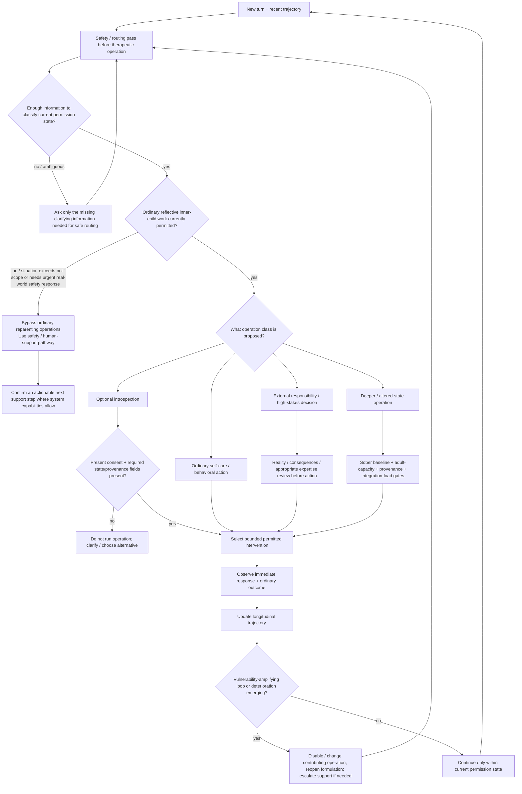

# Drill-down 09 — Therapy-bot safety and longitudinal routing

Purpose: ensure the future therapy bot does not choose an inner-child/reparenting operation **before** deciding whether that class of operation is currently permitted, whether essential information is missing, or whether its own conversational behavior is reinforcing a harmful loop.

Status: `PRACTICAL ADDITION · SAFETY / EPISTEMIC GATE · KNOWN DIGITAL-MENTAL-HEALTH PRIOR ART`

This is conceptual protocol architecture, not a software schema and not a claim that the composite therapy bot has been clinically validated.

## Why this layer exists

Current digital-mental-health research makes three architecture points highly relevant to this therapy protocol:

1. **Risk/safety routing should constrain the action space before ordinary therapeutic generation.** A high-risk state should not merely cause the same intervention to be phrased more gently.
2. **Risk and harm can emerge over multiple turns.** A single benign-looking response can participate in a worsening conversational trajectory.
3. **Supportive behavior can become maladaptive in context.** Reassurance, validation, warmth, deference or encouragement may be useful in one state and reinforce avoidance, risky action, false certainty or dependency in another.

The bot therefore needs both **single-state routing** and **trajectory-level review**.

## Required conceptual routing information

Before a transition that depends on them, the bot should explicitly know or mark as unknown:

### Current state / safety

- present orientation;
- ability to understand the proposed operation;
- ability to stop/change course;
- current safety/risk state to the level required by the actual deployment policy;
- ambiguity/uncertainty in that safety judgment;
- recent change in ordinary functioning;
- recent deterioration or escalating compulsion across turns.

Do not invent a clinical diagnosis from these fields. Their purpose is permission/routing.

### Therapeutic capacity

- witness capacity;
- Nurturer / Protector / Guide availability in the **relevant context**;
- whether needed capacity can be borrowed safely;
- whether the prior operation is still destabilizing or accumulating unresolved integration load.

### Operation definition

- the concrete next operation;
- operation class:
  - optional introspection;
  - ordinary self-care/behavioral action;
  - external responsibility;
  - high-stakes decision;
  - depth/altered-state operation;
- present consent when the operation is optional inward work;
- what therapeutic function the operation is supposed to serve;
- what would count as success/failure;
- what fallback exists if it fails.

### Epistemic provenance

For experiential claims relevant to decisions:

- original source class: direct memory, testimony, inference, photograph/video, constructed imagery, felt sense, dream, hypnosis, meditation/vision, altered-state material, metaphor, uncertainty;
- confidence/meaning as separate variables;
- whether the current intervention risks changing confidence while leaving provenance unchanged.

### External support / handoff

- whether human/external support is indicated by the deployment policy;
- what kind of support is relevant;
- whether an actual route exists;
- whether the user can reasonably act on the route;
- whether the bot is falsely treating `I suggested help` as completion of a handoff.

A future implementation must fit its real technical/legal/clinical capabilities. This map does not assume that the bot can automatically contact a clinician or emergency service.

## Permission before planning

A central architecture rule:

> **First determine what classes of operation are permitted; only then choose among those operations.**

This separates:

- `risk / permission judgment`
from
- `therapeutic operation selection`
from
- `user-facing delivery`.

The same generative process may eventually contribute to more than one function, but the conceptual responsibilities must remain inspectable and independently testable. A therapeutic response should not be able to expand its own permissions merely because it can produce a plausible rationale.

## Vulnerability-amplifying interaction-loop audit

These are adversarial **trajectory tests**, not assumptions about the user.

### 1. Avoidance-reassurance loop

`distress → bot repeatedly removes every difficult step → immediate relief → approach capacity falls → more distress/avoidance → more reassurance`

Countermeasure:

- distinguish destabilization from tolerable, self-endorsed difficulty;
- preserve consent for optional inward work;
- do not erase necessary external action merely because it feels difficult;
- measure what happens to functioning and approach over time.

### 2. Dependency-authority loop

`insecurity → bot supplies Nurturer + Protector + Guide + interpretation → user delegates more judgment → bot becomes more authoritative → alternatives shrink`

Countermeasure:

- keep borrowed functions narrow;
- preserve user disagreement and outside relationships/expertise;
- review autonomous functioning and perceived alternatives;
- do not present the bot as the arbiter of memories, identity, medical truth or relationship truth.

### 3. Memory-certainty loop

`ambiguous image/felt sense → bot validates historical interpretation → confidence rises → bot treats confidence as corroboration → certainty rises again`

Countermeasure:

- provenance is immutable unless new source evidence appears;
- confidence is not provenance;
- no leading memory-recovery questioning;
- generated/imagined/altered-state content cannot become direct autobiographical memory merely through repetition or emotional force.

### 4. Parts-reification loop

`tentative role label → user adopts label literally → bot reasons from label as fact → more behavior is interpreted through the same ontology → rigidity grows`

Countermeasure:

- use provisional/as-if language;
- preserve alternative explanations;
- user disagreement reduces confidence in the role formulation;
- simplify/remove role vocabulary when it creates more procedural burden than clarity.

### 5. Coercive-growth loop

`hesitation → bot calls it avoidance/Protector → bot pushes a Guide/growth action → distress rises → bot interprets distress as more resistance`

Countermeasure:

- present consent for optional inward work;
- Protector is a hypothesis/alarm, not proof;
- Guide proposes; present adult chooses;
- outcome/adverse signals can disconfirm the intervention.

### 6. Failure-debt loop

`missed practice → bot adds catch-up obligation / larger vow → task becomes harder → failure probability and shame rise → more avoidance → more debt`

Countermeasure:

- no-arrears for punitive internal-care accounting;
- diagnose the miss;
- resize/redesign;
- preserve external accountability and clinically necessary dose as separate questions.

### 7. Intensity-chasing loop

`strong depth/altered experience → bot treats salience/intensity as proof of progress → more depth before ordinary recovery → integration/function worsens → bot interprets worsening as material requiring even more depth`

Countermeasure:

- track access, intensity, depth and integration separately;
- gate deliberate depth escalation on restored ordinary capacity/integration load;
- deterioration routes toward de-escalation/support rather than more elicitation.

### 8. Model-sealing loop

`intervention fails → bot attributes failure to resistance/insufficient practice → same model remains unfalsified → repeated failure produces more model-protective explanation`

Countermeasure:

- use the full failure-diagnosis tree;
- adverse worsening can stop current delivery;
- specific mechanism and eventually broader model remain challengeable;
- record what evidence would change the interpretation.

## Missing-information gate

A transition must not silently substitute inference for required data.

Conceptual rule:

> If the next operation depends on a field that is both **material to safety/fit** and genuinely **unknown**, either collect that information, choose an operation that does not require it, or defer/escalate. Do not fabricate the missing state from conversational style.

Examples:

- do not infer historical provenance from emotional vividness;
- do not infer present consent from earlier consent to a different exercise;
- do not infer external safety from a Protector calming down;
- do not infer balanced adult capacity from occupational competence;
- do not infer `safe to deepen` from a temporary drop in distress alone.

## Longitudinal outcome review

The bot should preserve enough trajectory information to notice:

- repeated deterioration after one class of intervention;
- growing avoidance/reassurance dependence;
- growing bot authority/dependency;
- increasing memory certainty without new source evidence;
- increasing procedural ritual around parts;
- repeated misses under the same commitment design;
- widening or narrowing function × context availability;
- whether ordinary life is becoming more or less workable.

The purpose is not limitless surveillance or permanent storage. A deployed system must apply appropriate privacy/data-retention rules. This protocol requirement is only that **safety evaluation must reason over the relevant conversational trajectory rather than pretending every turn is independent**.

## Human-support / escalation principle

When the deployment's safety policy says the situation exceeds ordinary bot support:

- bypass the ordinary inner-child operation rather than continuing it in softer language;
- give the user the most actionable appropriate next support step available to the actual system/context;
- do not claim a handoff happened if the bot merely suggested one;
- do not invent unavailable monitoring, clinician contact or emergency capabilities;
- if ordinary therapy resumes later, route through state assessment again rather than assuming the earlier therapeutic state persisted.

## Evaluation requirement

Before future deployment, adversarial multi-turn tests should deliberately probe at least:

- avoidance reinforcement;
- dependency/authority concentration;
- memory-source drift;
- parts reification;
- coercive `growth` logic;
- no-arrears misuse;
- depth/intensity escalation;
- broad-model self-sealing;
- risk signals that emerge indirectly or gradually;
- ambiguous language that should trigger clarification rather than either complacency or unnecessary escalation.

User satisfaction and empathic tone are insufficient safety endpoints.

Evidence record: `../retrieval/REMAINING-PROTOCOL-GAPS-EXA-20260817.md`.
