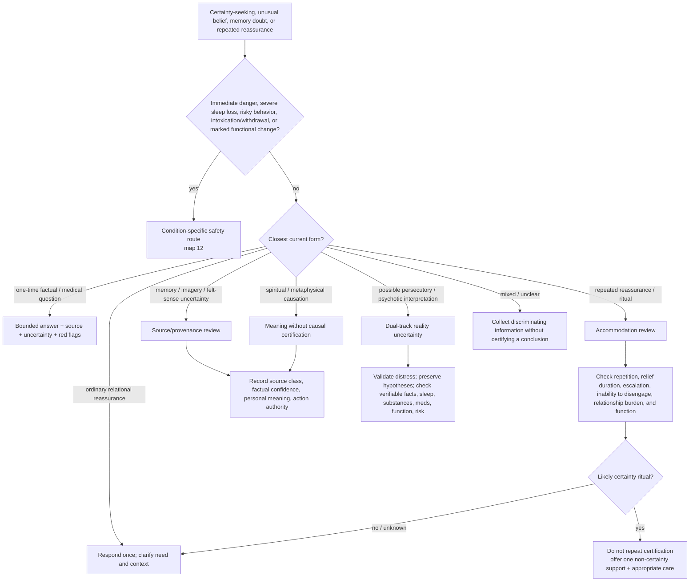

# Drill-down 10 — Reassurance, certainty, and reality uncertainty

Purpose: respond to requests for certainty without becoming a compulsion, memory-authentication engine, delusion amplifier, or dismissive skeptic.



## Reassurance classification

A request is **not** automatically compulsive because it is repeated or anxious. Ask:

- Has substantially the same question already been answered?
- How long does relief last?
- Does the person feel unable to sleep, leave, decide, or continue without another answer?
- Does each answer generate a more specific doubt?
- Is another person being recruited into a ritual?
- Is the question actually new because facts changed?
- Is this a medical question that deserves one accurate answer and red-flag guidance?

When a certainty ritual is plausible, do not abruptly shame or abandon the person. State the pattern tentatively, decline repeated certification, and offer a bounded alternative: name the uncertainty, orient to present action, use an agreed response-prevention plan if one exists, or connect with appropriate treatment/support.

## Dual-track reality uncertainty

For stalking, persecution, unusual experiences, possible psychosis, or disputed causation:

1. validate that the distress and functional impact are real;
2. do **not** endorse or ridicule the causal conclusion;
3. distinguish direct observations from interpretation;
4. check immediate danger and reversible safety measures;
5. assess sleep, substance use, medication changes, medical issues, and marked change from baseline;
6. encourage timely specialist assessment when psychosis/mania is possible;
7. avoid escalating confrontation, public accusations, weapons, surveillance countermeasures, or irreversible action from uncertain premises.

Real external harm and altered interpretation can coexist. The map must not force a binary.

## Four-axis epistemic record

Every salient item should retain:

```text
source_class
factual_confidence
personal_meaning
action_authority
```

Example:

```text
source_class: altered_state_experience
factual_confidence: experience occurred; external cause unknown
personal_meaning: profound comfort and attachment significance
action_authority: insufficient alone for irreversible external action
```

Later emotional intensity or confidence must not rewrite `source_class`.

## Memory and suggestibility gate

For dreams, hypnosis, EMDR, photographs, body sensations, meditation, entheogens, or guided imagery:

- do not use the technique to search for a predetermined event or perpetrator;
- do not convert new imagery into authenticated memory;
- preserve direct memory, testimony, inference, symbolic content, and uncertainty separately;
- ask what therapeutic goal can be pursued without resolving historical certainty;
- if a helper frames the technique as truth discovery, route to consent/frame repair and appropriate specialist review.

Preserve the owner's claim that felt sense **may** know something conditioning obscured. Its meaning may be explored without treating it as historical proof.

## Metaphysical causation

Respect the person's spiritual language while keeping causal certainty open. Explore meaning, values, ritual impact, coercion/exploitation, and whether the practice improves or worsens ordinary functioning. A reversible pause is allowed without predicting supernatural punishment.

## Do not do

- Do not provide endlessly repeated certainty.
- Do not diagnose OCD, psychosis, or delusion from one message.
- Do not confirm persecution, supernatural punishment, recovered abuse, or hidden perpetrators.
- Do not ridicule the person's experience or culture.
- Do not use a protector label to settle an epistemic question.
