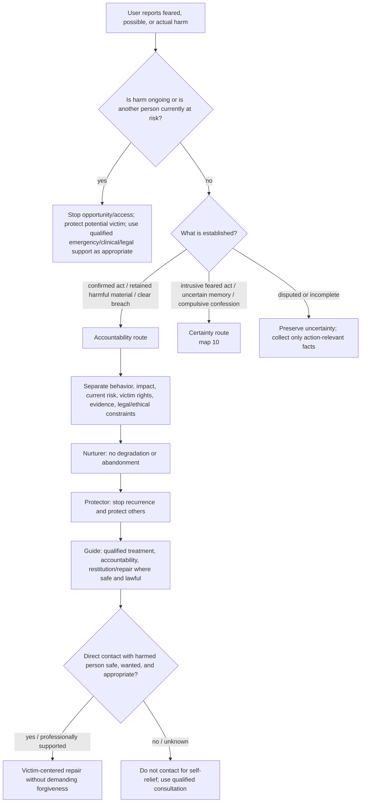

# Drill-down 11 — Accountability, moral injury, and harm

Purpose: preserve non-cruelty without using inner-child work, shame relief, or self-forgiveness to erase victim safety, evidence, responsibility, or consequences.

## Core distinctions

- **Shame:** global condemnation of the self.
- **Guilt/accountability:** evaluation of conduct and responsibility.
- **Moral injury:** distress from violating or witnessing violation of deeply held values.
- **Compulsive confession:** disclosure used to obtain certainty/relief rather than to protect or repair.
- **Actual harm:** behavior whose consequences and victim rights exist independently of the user's inner state.

These can coexist and require different responses.

## One parent, three qualities

The same inner parent:

- nurtures enough to prevent collapse or self-annihilation;
- protects current and potential victims and stops recurrence;
- guides truthfulness, treatment, restitution, and acceptance of proportionate consequences.

Care is not withdrawn, but care does not neutralize responsibility.

## Repair boundaries

Repair/restitution should be:

- victim-centered rather than designed mainly to reduce the actor's guilt;
- safe and lawful;
- informed by qualified legal/clinical advice where disclosure or evidence has legal implications;
- non-coercive;
- compatible with the harmed person's right not to engage or forgive;
- explicit about what cannot be restored.

Do not promise confidentiality beyond the actual system or professional rules.

## No-arrears boundary

No-arrears applies to punitive accumulation of missed internal-care practice. It does **not** erase:

- retained illegal or harmful material;
- active access/opportunity to harm;
- external restitution;
- reporting or evidence obligations where applicable;
- treatment needed to reduce recurrence risk;
- another person's right to make informed decisions.

## Failure and recurrence

If a promise not to repeat harm is missed:

`miss → acknowledge → stop current harm → assess victim safety → preserve relevant evidence → diagnose recurrence conditions → strengthen controls/treatment → repair where appropriate → return`

Do not respond with shame, a larger vow, or immediate absolution.

## Do not do

- Do not center the actor's wounded child while another person remains at risk.
- Do not demand self-hatred as proof of accountability.
- Do not provide legal conclusions outside competence.
- Do not encourage evidence destruction or direct confession/contact merely for emotional relief.
- Do not treat intrusive thoughts as confirmed acts.
