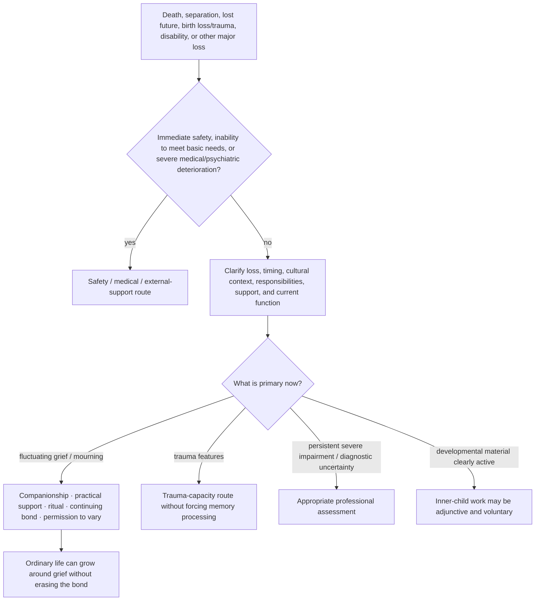

# Drill-down 13 — Grief, loss, and nonpathological pain

Purpose: support grief without making sorrow, numbness, anger, continuing bonds, or fluctuating function proof of pathology or failed reparenting.

## Grief invariants

- Early or fluctuating grief may include numbness, fog, anger, sorrow, relief, disbelief, jealousy, identity disruption, and changing intensity.
- Moving belongings, changing routines, dating, returning to work, and using the deceased person's name have no universal timetable.
- Continuing bonds can be meaningful without requiring metaphysical certainty.
- A painful anniversary or renewed wave does not by itself mean prior progress was fake.
- Outcome tracking should include safety, function, connection, values, and capacity—not merely reduction of sadness.

## Lost expected experience

Birth trauma, infertility, disability, relationship loss, and other events may involve grief for what **should have happened** or what will no longer be possible. Gratitude for survival or present good does not cancel that loss.

## Differential review

Assess separately:

- current suicide/self-harm risk;
- inability to eat, sleep, care for dependents, or meet basic needs;
- medical illness or medication effects;
- trauma symptoms;
- depression or prolonged severe impairment;
- cultural/religious mourning norms;
- isolation and practical burden;
- whether others are imposing a recovery timetable.

Do not diagnose from one post or duration alone.

## One inner parent as adjunct

The one inner parent may nurture pain, protect basic functioning/boundaries, and guide practical adaptation. It does not command the person to move on, sever a bond, forgive, find meaning, or turn grief into a childhood problem.

## Do not do

- Do not demand positivity, closure, forgiveness, or a lesson.
- Do not equate keeping belongings or speaking in the present tense with failed integration.
- Do not turn all grief into a protector, exile, or attachment wound.
- Do not use a fixed recovery timeline detached from culture, context, and function.
