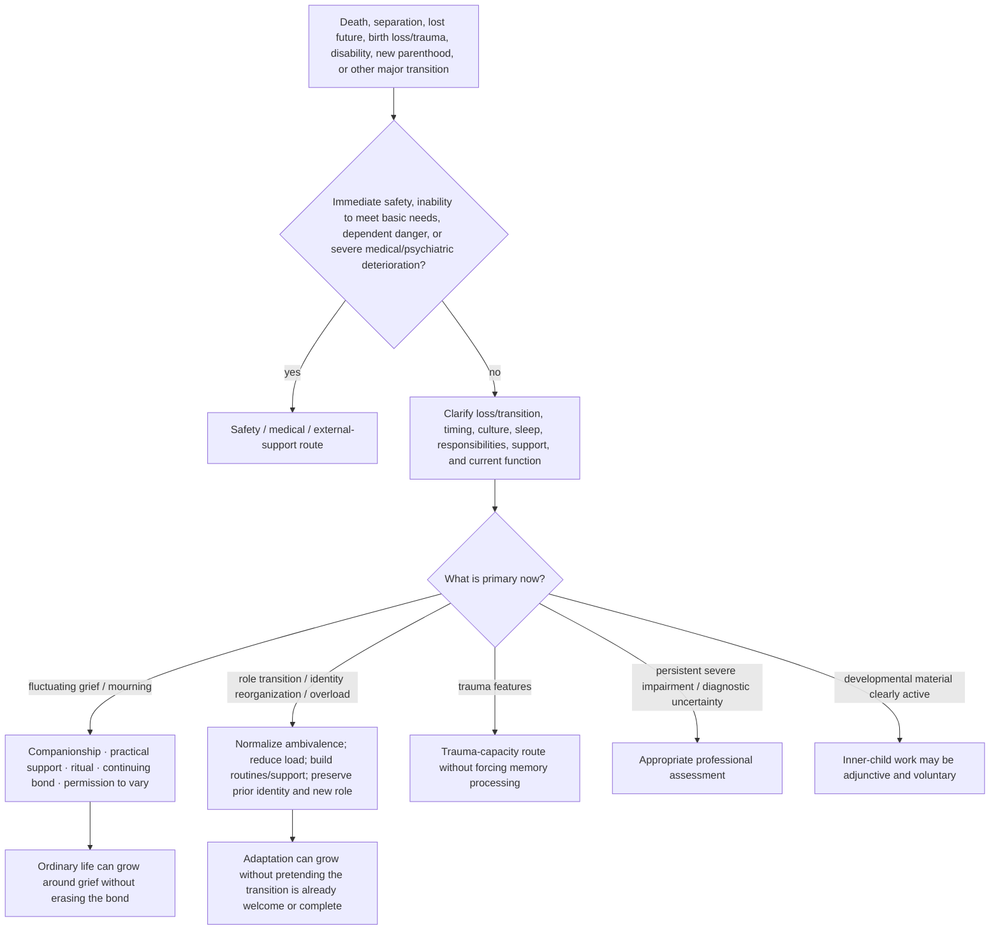

# Drill-down 13 — Grief, loss, major transition, and nonpathological pain

Purpose: support grief and major life transitions without making sorrow, numbness, regret, identity disorientation, continuing bonds, or fluctuating function proof of pathology or failed reparenting.

## Grief invariants

- Early or fluctuating grief may include numbness, fog, anger, sorrow, relief, disbelief, jealousy, identity disruption, and changing intensity.
- Moving belongings, changing routines, dating, returning to work, and using the deceased person's name have no universal timetable.
- Continuing bonds can be meaningful without requiring metaphysical certainty.
- A painful anniversary or renewed wave does not by itself mean prior progress was fake.
- Outcome tracking should include safety, function, connection, values, and capacity—not merely reduction of sadness.

## Lost expected experience

Birth trauma, infertility, disability, relationship loss, and other events may involve grief for what **should have happened** or what will no longer be possible. Gratitude for survival or present good does not cancel that loss.

## Major role transition

New parenthood, caregiving, marriage/divorce, migration, disability, retirement, and other role transitions can produce:

- loss of freedom or former routines;
- regret or `what have I done?` thoughts;
- sleep deprivation and objective overload;
- identity discontinuity;
- grief for a prior life;
- love and resentment at the same time;
- uncertainty about whether the reaction is temporary or signals a real mismatch.

Do not automatically infer childhood pathology, attachment failure, or rejection of the dependent/person involved.

Assess:

- sleep and physical recovery;
- actual workload and care coverage;
- safety of dependents;
- division of labor and practical resources;
- whether mood/anxiety symptoms warrant condition-specific assessment;
- what part of the previous identity/routine can be preserved;
- what expectations were unrealistic or unsupported;
- whether the person wants adaptation help, grief companionship, or a larger life decision.

Ambivalence is not proof of unfitness. It does not erase obligations or dependent safety.

## Differential review

Assess separately:

- current suicide/self-harm risk;
- inability to eat, sleep, care for dependents, or meet basic needs;
- medical illness or medication effects;
- trauma symptoms;
- depression or prolonged severe impairment;
- cultural/religious mourning norms;
- isolation and practical burden;
- whether others are imposing a recovery timetable.

Do not diagnose from one post or duration alone.

## One inner parent as adjunct

The one inner parent may nurture pain, protect basic functioning/boundaries, and guide practical adaptation. It does not command the person to move on, sever a bond, forgive, find meaning, welcome a role instantly, or turn grief/transition into a childhood problem.

## Do not do

- Do not demand positivity, closure, forgiveness, gratitude, or a lesson.
- Do not equate keeping belongings, speaking in the present tense, regret, or lost identity with failed integration.
- Do not turn all grief or transition distress into a protector, exile, or attachment wound.
- Do not use a fixed recovery timeline detached from culture, context, function, sleep, and structural load.
- Do not infer that a parent dislikes or rejects a child merely because early parenthood feels unbearable.
