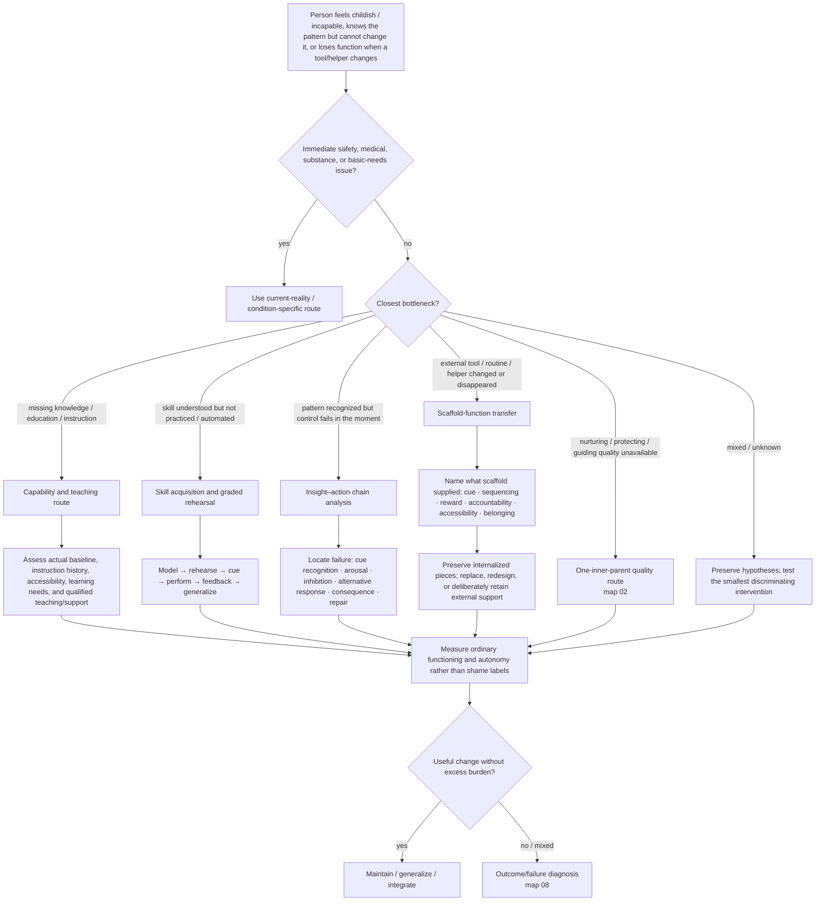

# Drill-down 15 — Capability, skill, scaffold, and insight–action gap

Purpose: distinguish missing knowledge or instruction, unpracticed skill, executive/environmental support needs, awareness without behavioral control, loss of an external scaffold, and genuinely unavailable qualities of the one inner parent.

## Insight is not control

Witness capacity or intellectual self-awareness establishes only that some part of the pattern can be observed or described. It does **not** establish:

- inhibitory control during high activation;
- access to a practiced alternative response;
- emotional learning;
- physiological regulation;
- procedural skill;
- environmental support;
- the ability to repair after failure;
- an integrated inner parent.

When a person already understands why a pattern occurs, repeating the explanation is not treatment. Ask where the change chain actually fails.

## Missing instruction is not a missing Guide

A person may lack schooling, financial knowledge, household skills, executive-function support, social information, or practice because nobody taught them or access was blocked. Do not translate educational deprivation into immaturity or deficient inner adulthood.

Assess:

- what was and was not taught;
- the person's current baseline rather than age-based assumptions;
- learning, disability, language, sensory, and access needs;
- whether formal assessment is warranted;
- qualified teaching, tutoring, occupational support, accessible tools, or stepwise practice;
- shame and identity injury as a parallel problem, not the explanation for the skill gap.

The one inner parent's Guide quality can support learning. It cannot substitute for the missing information or instructor.

## Insight–action chain

When the person says `I know exactly what I do and still cannot stop`, localize the bottleneck:

1. Is the cue noticed before, during, or only after the behavior?
2. How rapidly does activation rise?
3. Is there a moment of choice but no effective alternative?
4. Is the alternative known conceptually but not rehearsed under realistic conditions?
5. Does the environment repeatedly defeat the intended response?
6. Are sleep, substances, medication, pain, neurodevelopmental factors, or medical issues changing control?
7. What happens immediately after the behavior—relief, reward, escape, shame, repair?
8. What smallest observable change would show that the bottleneck moved?

Do not infer diagnosis from the chain alone.

## External scaffold-function transfer

External scaffolds include apps, calendars, reminders, checklists, groups, medication organizers, coaches, therapists, structured workplaces, family routines, and accessibility tools.

When a scaffold changes or disappears:

1. identify precisely what it supplied;
2. identify what was internalized and what was never meant to internalize;
3. distinguish skill loss from cue/reward/access loss;
4. preserve successful routines where possible;
5. replace or redesign the scaffold before declaring treatment failure;
6. allow permanent external accommodation when appropriate;
7. monitor burden, compulsive engagement, commercial manipulation, and loss of user control.

Losing function after a scaffold fails does not prove that prior gains were fake or that the person failed to internalize adulthood.

## Capability versus moral judgment

Labels such as `lazy`, `childish`, `dependent`, `unmotivated`, or `not trying` are not capability measurements. Ask what the person can do:

- independently;
- with a cue;
- with instruction/modeling;
- with environmental adaptation;
- when calm versus overloaded;
- once versus consistently;
- in one context versus another.

## Do not do

- Do not prescribe more insight when the person already understands the formulation.
- Do not call educational deprivation a protector or missing Guide.
- Do not demand that disability-related or practical supports be internalized away.
- Do not treat an app/helper/tool as proof of dependency merely because it is useful.
- Do not interpret loss of a scaffold as a character failure.
- Do not create a large remediation curriculum before selecting one functional bottleneck.
