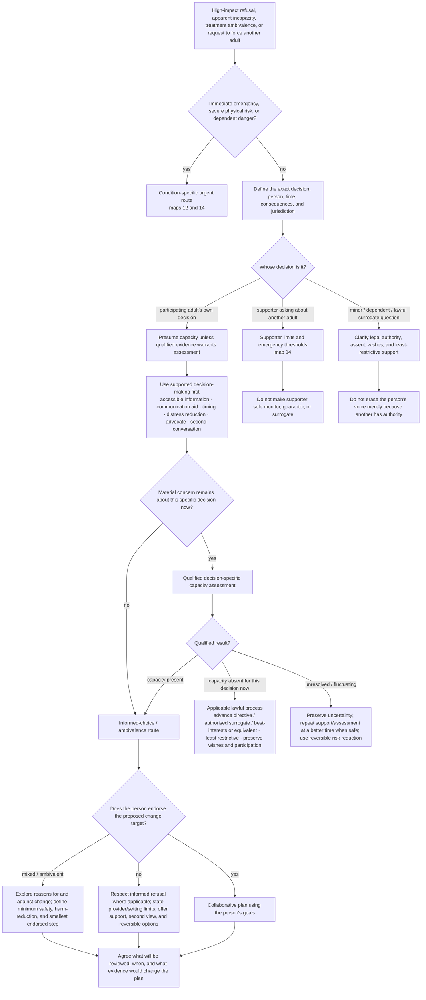

# Drill-down 16 — Decision capacity, supported choice, and ambivalence

Purpose: respond safely when a person refuses care, appears unable to protect themselves, seeks help without endorsing the proposed change target, or asks whether another adult can be forced into treatment.

Status: **PRACTICAL SAFETY / AUTONOMY CORRECTION · KNOWN PRIOR ART**

This map is not a legal-capacity assessment. Capacity law, emergency authority, guardianship, advance directives, compulsory treatment, and surrogate decision-making vary by jurisdiction and setting. A therapy bot may identify that qualified assessment or legal/clinical clarification is needed; it must not appoint a decision-maker or declare a person legally capable/incapable.



## Core capacity rules

1. **Capacity is decision-specific and time-specific.** Capacity to choose lunch, manage money, refuse one medication, consent to surgery, or decide where to live are not one global status.
2. **Presume capacity unless qualified evidence warrants assessment.** Diagnosis, disability, dementia, eating disorder, addiction, psychosis history, family disagreement, unusual values, or a risky choice do not by themselves establish incapacity.
3. **An unwise decision is not incapacity.** The quality or popularity of the choice is not the test.
4. **Insight is not capacity, and lack of insight is not automatically incapacity.** The question is whether impairment prevents the person from making the specific decision, after practicable support.
5. **Supported decision-making comes first when feasible.** Improve communication, information, timing, environment, memory support, distress, and access to a trusted advocate before concluding that the person cannot decide.
6. **The bot does not conduct or certify legal/clinical capacity assessments.** It can collect concern signals and route to appropriately qualified assessment.
7. **Fluctuation matters.** Acute delirium, intoxication, withdrawal, severe sleep loss, pain, medication effects, mania, psychosis, stroke, and other conditions may change decision-making temporarily.
8. **Supporter concern does not create surrogate authority.** A spouse, adult child, friend, or chatbot does not become the decision-maker merely because the person refuses help.
9. **Where lawful substitute decision-making applies, preserve the person's participation, known wishes, values, advance choices, and least-restrictive alternative.** Do not use `best interests` as a blank cheque for convenience or control.

## Decision-specific concern record

Conceptual fields:

```text
decision_subject
decision_owner
decision_deadline
decision_impact
current_capacity_status: presumed | qualified_present | qualified_absent | fluctuating | disputed | unknown
capacity_concern_basis
support_steps_attempted
communication_or_access_need
undue_influence_or_coercion
advance_directive_or_known_wishes
lawful_decision_maker_status
least_restrictive_option
review_time_or_trigger
```

Do not infer `qualified_absent` from conversational tone.

## Ambivalence is not resistance or incapacity

A person can:

- seek relief without endorsing full recovery;
- want fewer consequences without wanting abstinence;
- want physical safety while fearing weight restoration;
- want a relationship to improve while remaining unsure about staying;
- want help with distress but reject the helper's causal theory;
- agree to monitoring while declining a particular treatment.

Separate these targets:

```text
person_owned_goal
minimum_safety_goal
harm_reduction_goal
full_change_goal
provider_or_setting_condition
third_party_or_dependent_safety_goal
```

The bot must not quietly replace the person's goal with its preferred endpoint. It may state serious risks, explain what it cannot safely provide, and protect dependents or other people without pretending that coercion is collaboration.

### When the target is mixed

1. ask what the person wants more of, less of, or protected;
2. ask what they fear losing if they change;
3. state material risks plainly without exaggeration;
4. identify the smallest genuinely endorsed step;
5. preserve harm-reduction and monitoring even when full change is not endorsed;
6. define a review point and what new information would matter;
7. do not use repeated motivational dialogue as covert pressure after a clear informed refusal.

## Eating-disorder and severe-physical-risk boundary

For severe malnutrition, dehydration, electrolyte disturbance, organ risk, acute suicidality, or medically dangerous refeeding/relapse concerns:

- map 12 governs immediate medical and specialist routing;
- this map governs goal endorsement, decision support, and any qualified capacity/legal process;
- do not give individualized meal, calorie, refeeding, electrolyte, or compulsory-treatment instructions;
- do not treat weight restoration, diagnosis, or refusal alone as proof of incapacity;
- where serious physical risk and refusal coexist, route to a competent multidisciplinary eating-disorder/medical team and applicable law.

## Supporter asking how to force treatment

The supporter can:

- report concrete risk to appropriate services;
- state observations and limits;
- offer transport, information, or chosen support;
- protect dependents and themselves;
- define emergency thresholds and backup;
- seek their own legal, medical, financial, safeguarding, or emotional support.

The supporter cannot be made responsible for:

- continuously preventing another adult's suicide;
- monitoring them every hour;
- making them want treatment;
- guaranteeing medication adherence;
- remaining in a dangerous or coercive relationship as the price of helping;
- acting as a lawful surrogate without actual authority.

## Do not do

- Do not call a refusal `the Protector` and use that label to bypass it.
- Do not equate diagnosis, risk, disagreement, lack of insight, or family burden with incapacity.
- Do not tell a supporter to force, deceive, restrain, medicate, or secretly monitor another adult.
- Do not treat `best interests` as whatever reduces caregiver burden.
- Do not abandon safety monitoring merely because full treatment is declined.
- Do not use motivational interviewing as an endless persuasion loop.
- Do not promise what local law or emergency services will do.
